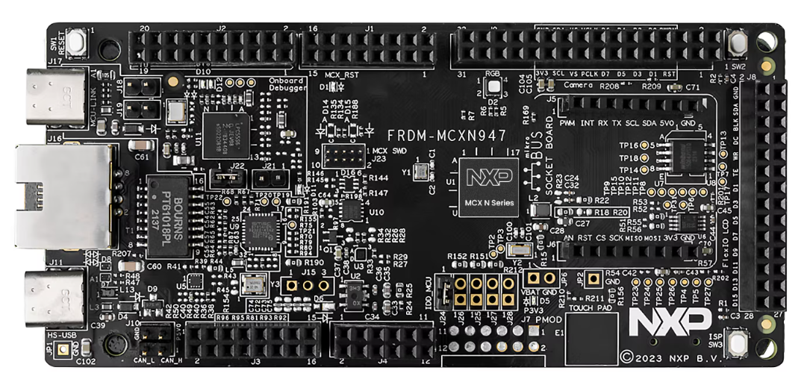
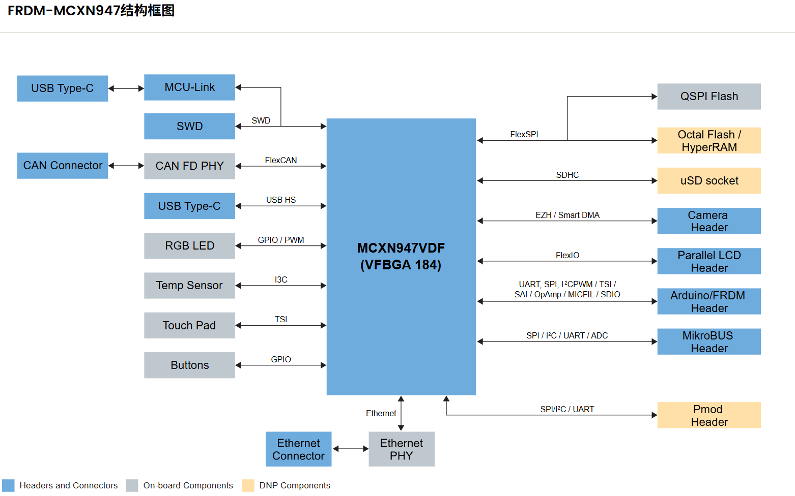
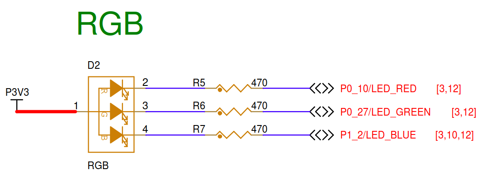
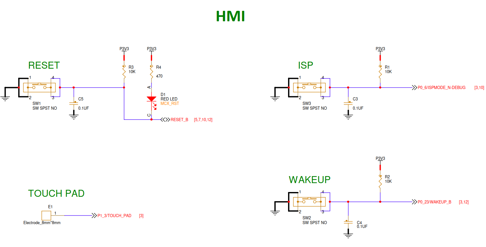

# FRDM-MCXN947开发板

FRDM-MCXN947是一款紧凑且可扩展的开发板，可让您快速基于MCX N94和N54 MCU开展原型设计。它们提供行业标准的接口，可轻松访问MCU的I/O、集成的开放标准串行接口、外部闪存和板载MCU-Link调试器.

## 开发板信息

顶视图

结构框图

## 引脚配置

### RGB LED

RGB引脚配置
* LED_R P0_10   低电平有效
* LED_G P0_27   低电平有效
* LED_B P1_2    低电平有效

### 按键

按键引脚配置
* SW1   RESET_B         低电平有效,连接多个IC复位引脚
* SW2   WAKEUP  P0_23   低电平有效,连接多个IC复位引脚
* SW3   ISP     P0_6    低电平有效
* Touch_Pad     P1_3    模拟输入
