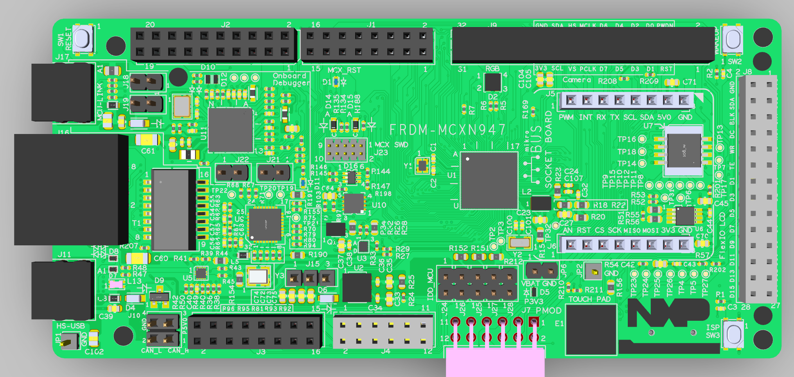
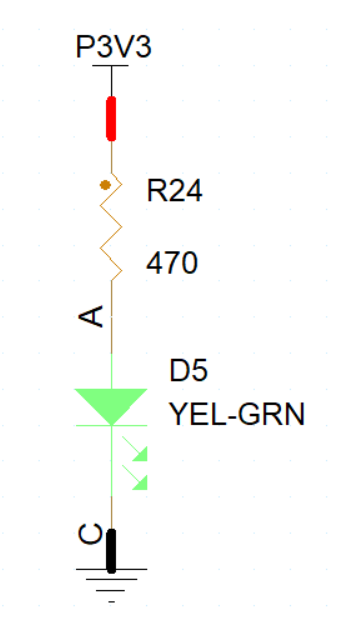
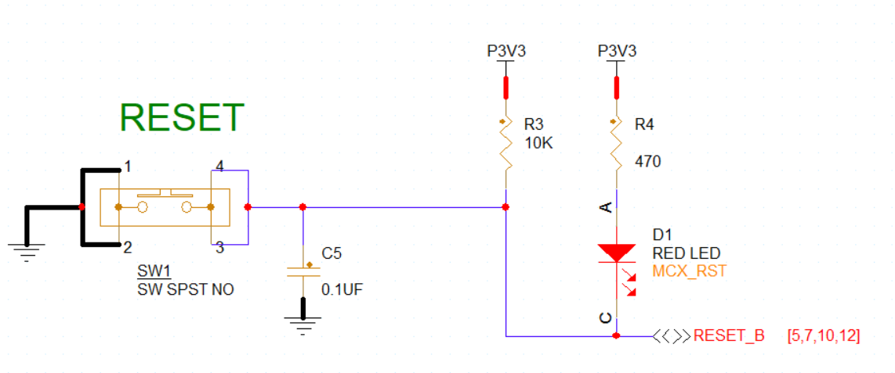
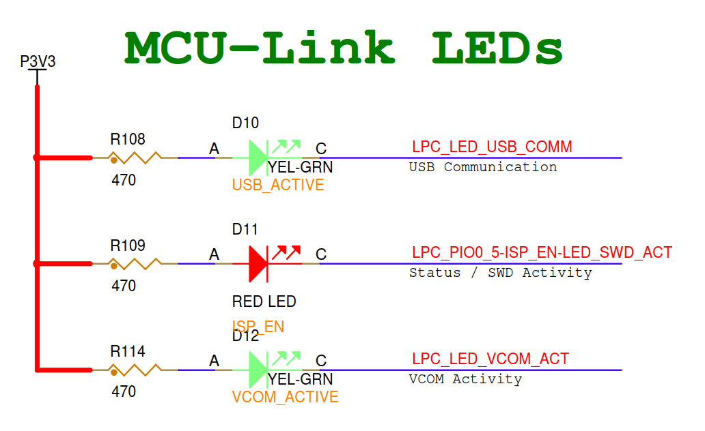
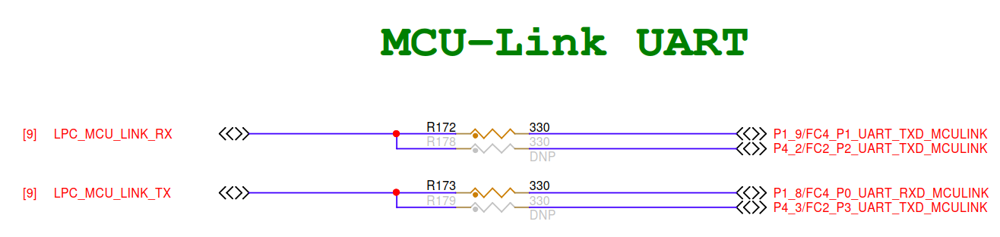

# FRDM-MCXN947开发板

FRDM-MCXN947是一款紧凑且可扩展的开发板，可让您快速基于MCX N94和N54 MCU开展原型设计。它们提供行业标准的接口，可轻松访问MCU的I/O、集成的开放标准串行接口、外部闪存和板载MCU-Link调试器.

---

## 开发板信息

顶视图

结构框图

指示灯作用

---

### 电源指示灯复位指示灯

---

### 复位指示灯

---

### MCU-Link各个 LED 的具体含义

| 信号名称 | 对应的 LED 作用 | 状态说明 |
| :--- | :--- | :--- |
| **LPC_LED_USB_COMM** | **USB 通信指示** | 当调试器通过 USB 线连接到电脑，并且电脑正在识别或枚举调试设备时，这个灯会闪烁或亮起。 |
| **LPC_PIO0_5-ISP_EN-LED_SWD_ACT** | **SWD 活动指示** | 这是最关键的灯。当你点击 IDE 里的 **Debug** 或 **Download** 时，调试器通过 SWD 协议往主芯片写代码，这个灯会**高频闪烁**，表示正在“搬运”数据。 |
| **LPC_LED_VCOM_ACT** | **虚拟串口活动指示** | 当你使用串口助手（如板载的 VCOM 串口）查看 `PRINTF` 打印出的“Hello World”时，如果有数据传输，这个灯会闪烁。 |

### 为什么了解它们对你很重要？

作为新手程序员，观察这三个灯可以帮你快速判断**“到底是哪里出错了”**：

* **如果 `LED_SWD_ACT` 狂闪后报错**：
    说明调试器尝试联系主芯片，但主芯片没响应。这通常是因为你刚才提到的 **32.768kHz 晶振卡死** 导致主芯片锁死了，调试器进不去。
* **如果 `LED_VCOM_ACT` 从不闪烁**：
    说明你的 `PRINTF` 代码根本没有运行，或者串口引脚配置（FLEXCOMM）有问题，数据根本没发出来。
* **如果 `USB_COMM` 不亮**：
    换根 USB 线吧，电脑根本没认出这块板子。

---

## 引脚配置

### RGB LED

RGB引脚配置
* LED_R P0_10   低电平有效
* LED_G P0_27   低电平有效
* LED_B P1_2    低电平有效

### 按键

按键引脚配置
* SW1   RESET_B         低电平有效,连接多个IC复位引脚
* SW2   WAKEUP  P0_23   低电平有效,连接多个IC复位引脚
* SW3   ISP     P0_6    低电平有效
* Touch_Pad     P1_3    模拟输入

### UART

UART引脚配置
* UART_TXD  P1_9/FC4_P1_UART_TXD
* UART_RXD  P1_8/FC4_P0_UART_RXD
