# 存储器系统框图

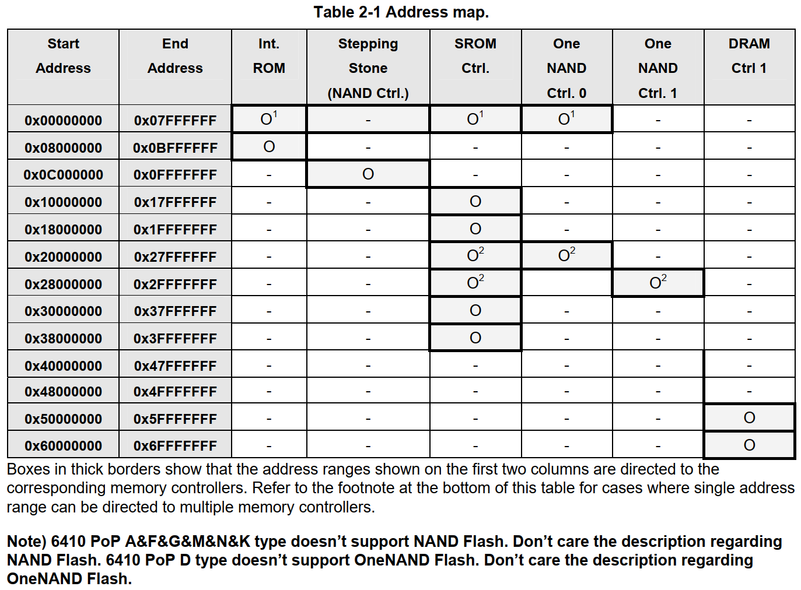

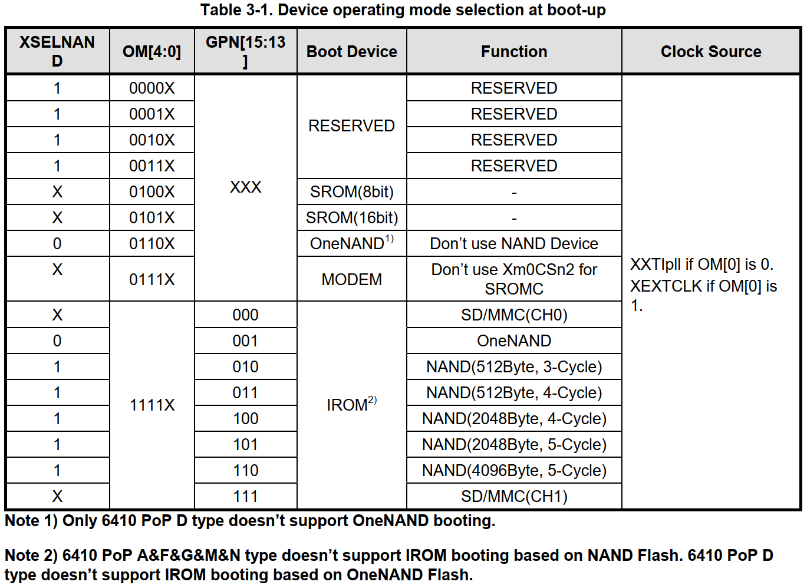

## OK6410启动模式选择表
| 开关标识 | 1 | 2 | 3 | 4 | 5 | 6 | 7 | 8 |
|:---:|:---:|:---:|:---:|:---:|:---:|:---:|:---:|:---:|
| 信号 | XSELNAND | OM4 | OM3 | OM2 | OM1 | GPN15 | GPN14 | GPN13 |
| NAND启动 | 1 | 1 | 1 | 0 | 0 | 1 | 1 | 0 |
| SD启动   | 1 | 1 | 1 | 0 | 0 | 0 | 0 | 0 |

## 概述

> * 6410支持32位物理地址字段，该地址字段可以分为两部分，一部分用于内存，另一部分用于外围设备。
> * 主存储器通过SPINE总线访问，其地址范围为0x0000_0000至0x6FFF_FFFF(1.5G)。 该主存储部分分为四个区域，即启动映像区域，内部存储区域，静态存储区域和动态存储区域。
> * 引导映像区的地址范围是0x0000_0000到0x07FF_FFFF(128M)，但是没有实际的映射内存。引导映像区具有镜像映像，该映像指向内部存储区或静态存储区的部分区域。引导映像的起始地址固定为0x0000_0000。
> * 内部存储区用于访问内部ROM和内部SRAM，以用于引导加载程序，也称为**Stepping Stone**。每个内部存储器的起始地址是固定的。内部ROM的地址范围从0x0800_0000到0x0BFF_FFFF，但实际存储空间仅为**32KB**。该区域是**只读**的，并且在选择内部ROM引导时可以映射到引导映像区域。内部SRAM的地址范围从0x0C00_0000到0x0FFF_FFFF，但**实际存储空间仅为{~~4KB~>8KB~~}**。
> * 静态存储区的地址范围为0x1000_0000至0x3FFF_FFFF(6*128M)。 可以通过该地址区访问SROM，SRAM，NOR闪存，异步NOR接口设备，OneNAND闪存和Steppingstone。每个区域代表片选，例如，从0x1000_0000到0x17FF_FFFF的地址范围代表Xm0CSn[0]。每个芯片选择的起始地址是固定的。不能通过静态存储区访问NAND Flash和CF/ATA，因此，如果Xm0CSn[5:2]中的任何一个映射到NFCON或CFCON，则不应访问相关的地址区域。 一个例外是，如果Xm0CSn[2]用于NAND闪存，则垫脚石镜像到从0x2000_0000到27FF_FFFF的地址区域。
> * 动态存储区的地址范围为0x4000_0000至0x6FFF_FFFF(3*256M)。DMC1有权使用从0x5000_0000到0x6FFF_FFFF的地址范围。 每个芯片选择的起始地址都是可配置的。
> * 通过PERI总线访问外围设备，其地址范围从0x7000_0000到0x7FFF_FFFF。 可以在该地址范围内访问所有SFR。 另外，如果需要数据从NFCON或CFCON传输，则这些数据应通过PERI总线传输。

## 设备特定地址空间

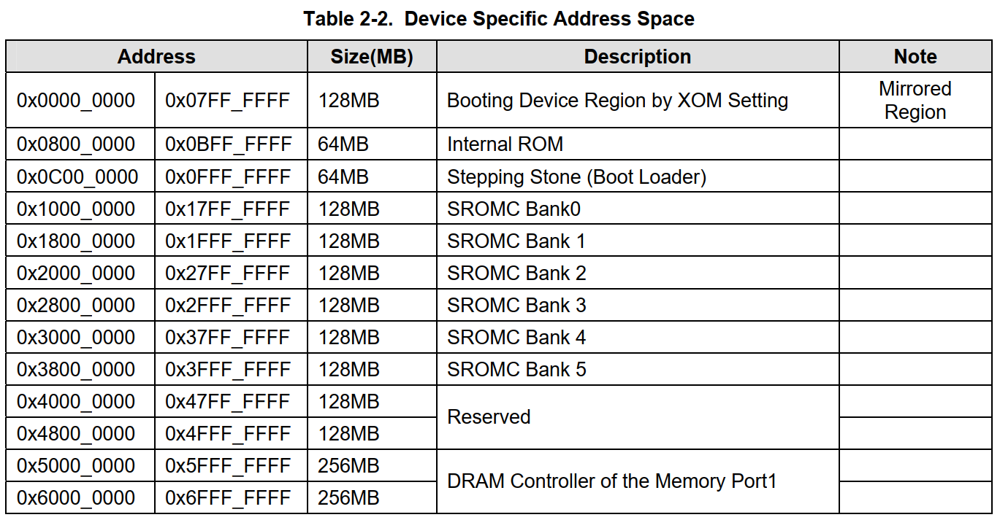

> **首先选择启动设备（SD，NAND在OK6410中都属于IROM），当选择IROM设备启动时，IROM会镜像到0x0000_0000地址区域，开始执行IROM里面的代码（BL0），IROM大小为32KB，代码操作是相对地址。BL0会根据实际启动设备（SD或者NAND）选择对应程序拷贝BL1代码到Stepping Stone，BL1可以进行相关的操作，但最重要的是初始化SDRAM控制器并把最终的U-Boot复制到SDRAM。**

# S3C6410 IROM Booting

## 操作顺序

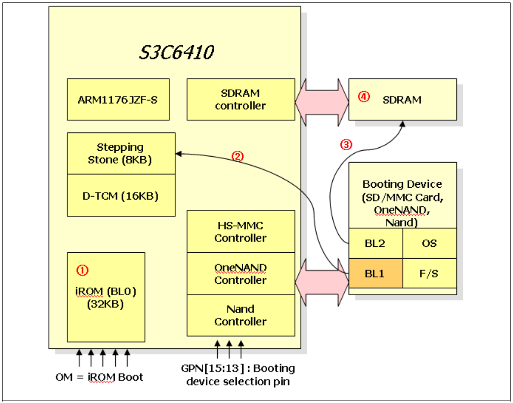
> ①iROM支持初始启动：初始化系统时钟，D-TCM，设备专用控制器和启动设备。
> ②iROM引导代码可以将4KB的引导加载程序加载到垫脚石上。  8KB的引​​导加载程序称为BL1。
> ③BL1：BL1可以为用户初始化系统时钟，UART和SDRAM。 初始化后，BL1将在SDRAM上加载剩余的引导加载程序，称为BL2。
> ④最后，跳转到BL2的起始地址。 那将为使用系统创造良好的环境。

## iROM(BL0)的启动顺序

> 请执行以下步骤进行iROM（BL0）的启动：
1.禁用看门狗定时器
2.初始化TCM。  （请参阅第2.4章的“内存映射”部分。）
3.初始化块设备复制功能。  （请参考第2.6章的“设备复制功能”部分）
4.初始化堆栈区域（请参考第2.4章的“存储器映射”部分）
5.初始化PLL。  （请参阅第2.7章的“时钟配置”部分。）
6.初始化指令缓存。
7.初始化堆区域。  （请参阅第2.4章的“内存映射”部分。）
8.将BL1复制到垫脚石区域（请参阅第2.6章的“设备复制功能”部分）
9.验证BL1的完整性
10.跳转到台阶 
**注意**：ECC错误和引导加载程序验证失败请参考第4章

## iROM(BL0)启动流程框图

启动流程框图.png)

## iROM(BL0)启动内存分布

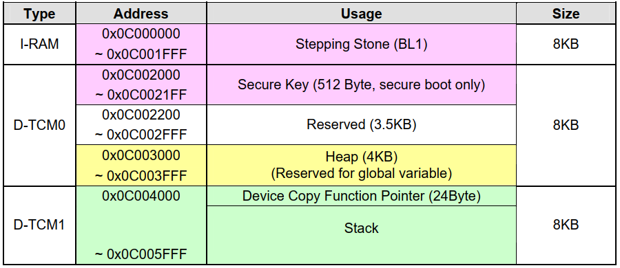
> **注意**：启动后，D-TCM可以使用另一种用法。

## 全局变量

> 如果使用MMC设备进行启动，则MMC卡的信息必须保存在特殊区域中。

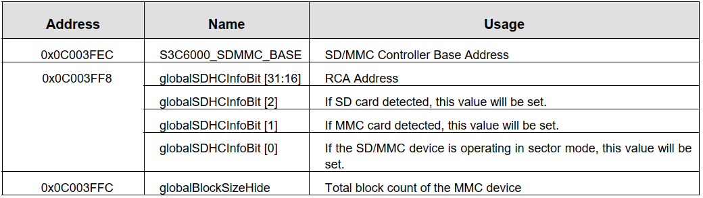
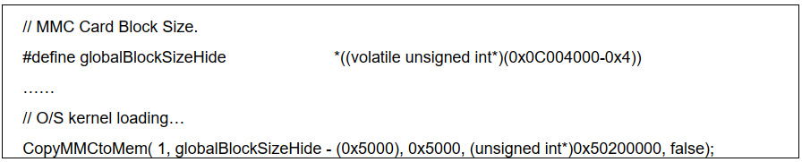

```c {.line-numbers highlight=5}
// MMC Card Block Size.
#define globalBlockSizeHide *((volatile unsigned int*)(0x0C004000-0x4))

// O/S kernel loading
CopyMMCtoMem( 1, globalBlockSizeHide - (0x5000), 0x5000, (unsigned int*)0x50200000, false);
```

## 设备复制功能

> S3C6410内部包含用于boot-u设备的块复制功能的ROM代码。因此，开发人员不需要实施设备复制功能。这些内部功能可以将任何数据从存储设备复制到SDRAM。内部ROM引导过程完成后，用户可以使用这些功能。

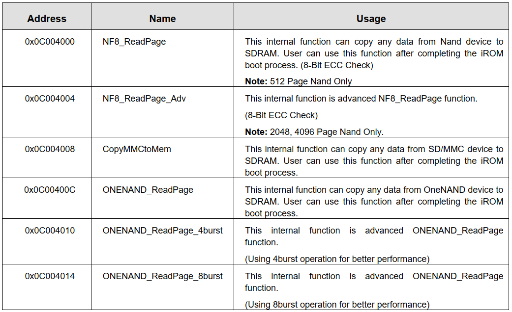

## 引导块分配指南

> **SD卡，SDHC卡，SDXC卡区别在于规格不一样，SD卡最大支持2GB容量，SDHC 最大支持32GB容量，SDXC 最大支持2TB(2048GB)容量，支持SDXC卡的数码设备是兼容支持SD卡与SDHC卡的，如果设备只有支持SDHC卡，那么这个设备就不能使用SDXC卡，但兼容SD卡。如果设备只支持SD卡，则不兼容SDXC，SDHC卡。**

### SD/MMC引导块分配指南

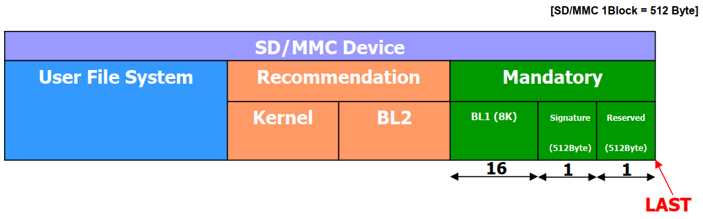
> 本指南是一个示例，但有3条强制性规则。
>
> * 不应使用最后一个块.（保留）
> * 必须为偏移量[LAST – 2]分配一个块用于签名
> * BL1（第一引导加载程序）的偏移量[LAST – 18]

### SDHC引导块分配指南

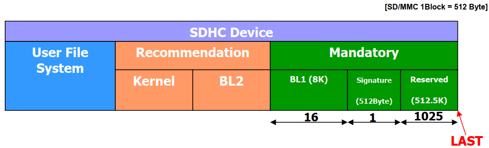
> 本指南是一个示例，但有3条强制性规则。
>
> * 不应使用最后的1025个块。（在下面的已知问题中描述）
> * 必须为位于偏移[LAST – 1026]处的签名分配一个块
> * BL1（第一引导加载程序）应位于偏移[LAST – 1042]处 
>
> **已知问题**
当iROM使用SDHC卡引导时，计算出的卡大小小于原始卡大小，取整为1024个块。 因此，SDHC卡具有额外的保留块（512 KB）。

### NAND Device Boot Block Assignment (Address Cycle 3 or 4, Page Size = 512 Byte)


> 本指南仅作为示例，但有2条强制性规则。
>
> * BL1（第一个引导加载程序）应位于第0块的第0页。
> * 位于第0块的第16页的页面已分配用于签名。

###  NAND Device Boot Block Assignment (Address Cycle 4 or 5, Page Size = 2048 Byte)

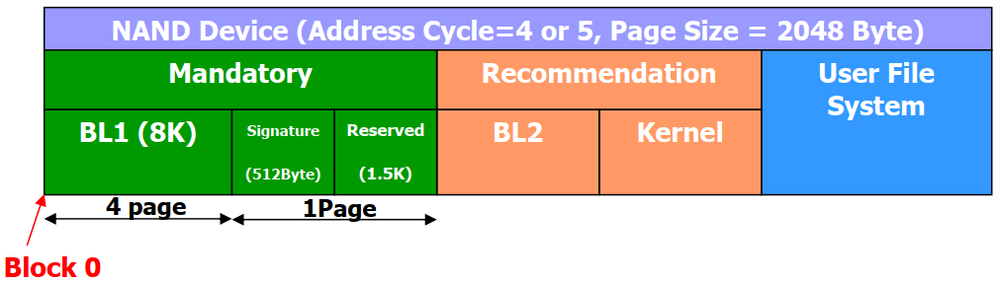

> 本指南仅作为示例，但有2条强制性规则。
>
> * BL1（第一个引导加载程序）应位于块0和第0页。
> * 位于第0块的第4页的页面已分配用于签名。

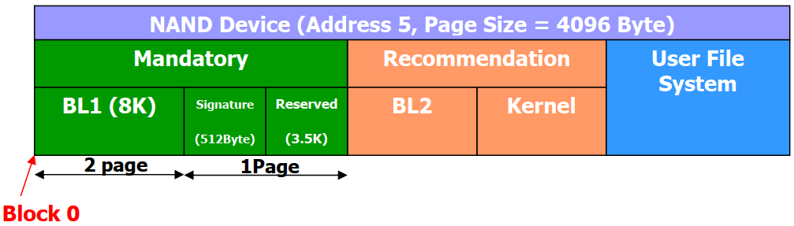

> 本指南仅作为示例，但有2条强制性规则。
>
> * BL1（第一个引导加载程序）应位于块0和第0页。
> * 位于第0块的第2页的页面已分配用于签名。

### OK6410配置

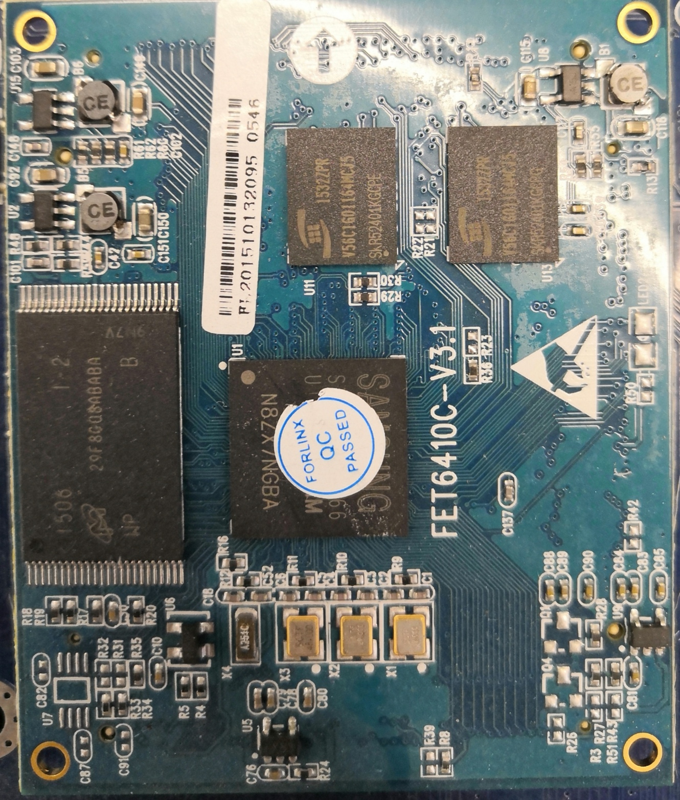

> 本开发板配置：
NAND FLASH为MT29F8G08ABABAWP **（8Gb，每页4KB）**。
DDR 为V56C1601164MCJ5 **（128MB * 2）**。
>
> * 当系统以Nand方式启动时，硬件将Nand Flash的前8KB拷贝到Steppingstone，然后从0地址开始运行程序，在这8KB以内代码中，我们需要完成必要的硬件初始化，如果代码超过8K，我们还需要将剩余代码的搬移到链接地址处，一般在SDRAM/DDR中。其中，硬件部分需要初始化系统时钟、DDR和NAND Flash三部分。
> * S3C6410启动时拷贝的8K代码不是存储在Nand flash的第一页上，而是存储在Nand flash的前4页上，每页2K，总共8K，这是S3C6410芯片的硬件结构决定的！也就是说，虽然我们的Nand flash的页大小是4K，但是S3C6410为了适应各种型号的Nand flash并保证硬件能正确的拷贝Nand flash中的前8K到SRAM中，硬性的加上这一规定。