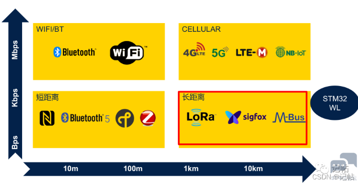
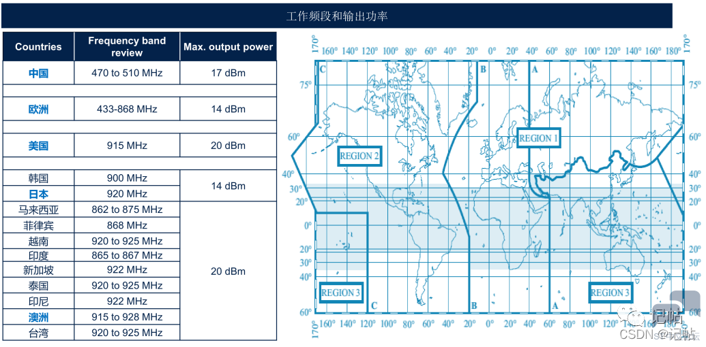
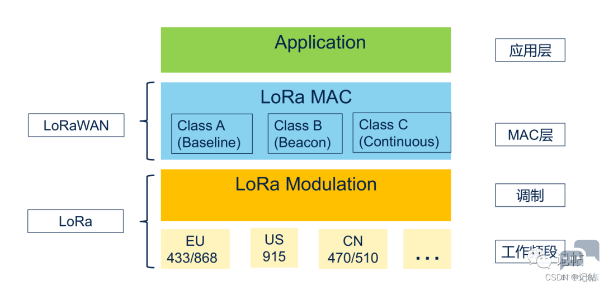
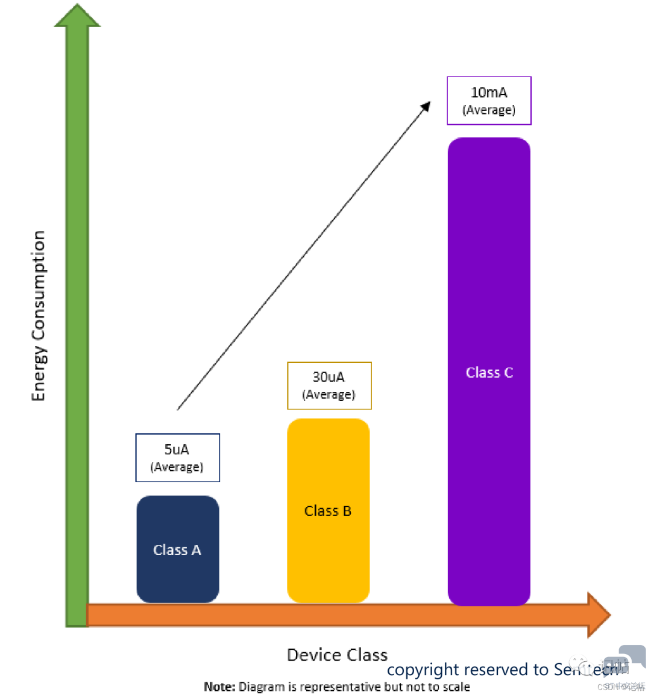

# 概述

## 无线通讯技术

按照距离和传输速率，可以分为如下图所示。

## LORA的前身

LoRa是 由法国公司Cycleo（于2009年作为IP和设计解决方案提供商成立）开发的专利技术，用于扩频无线调制。
* 2012年， Cycleo被Semtech（美国）以约500万美元的价格收购。
* 2015年Semtech建立了LoRa联盟。包括意法半导体，瑞萨电子，微芯，软银，阿里巴巴，亚马逊，思科，RisingHF，CLAATEK等。

## LORA技术方面

LoRa（Long Range）是Semtech公司的调制技术，用于低功耗，广域网（LPWAN）。
* LoRa是物理层。
* LoRa 基于线性调频扩频（CSS）通信和工作在免许可证的SubGHz 频段。

## 全球LORA工作频段

可以看见，在中国使用的频段主要是470~510Mhz。

## LoRa和LoRaWAN区别

LoRa是物理层，LoRa定义了调制技术和频段，LoRaWAN是上层的一种开关协议，定义了mac层。

## LoRaWAN 节点定义

节点的类别主要是有Class A, Class B, Class C。
    基于LoRaWAN的终端设备可能会根据其设备类别以三种模式之一运行。
  * 所有此类设备必须支持Class A操作。
  * Class B设备必须同时支持Class A和Class B模式。
  * Class C设备必须支持Class A。这些操作模式与设备与网络的通信方式有关。
    由下图也可以得知，Class A, Class B, Class C的功耗种Class A最小，Class C功耗最大。

