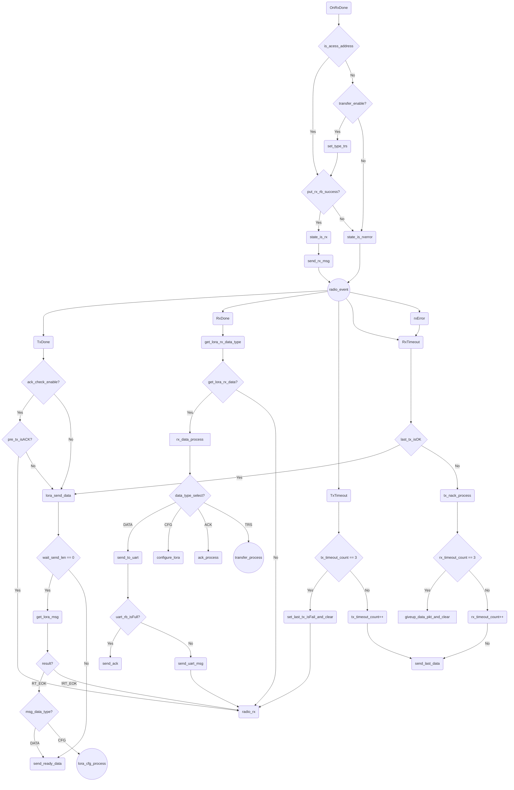

> 参考资料：
> https://shd101wyy.github.io/markdown-preview-enhanced/#/zh-cn/diagrams
> https://github.com/mermaid-js/mermaid/blob/develop/README.zh-CN.md

```mermaid
flowchart TB
    state((radio_event))
    state --> tx(TxDone)
    state --> rx(RxDone)
    state --> txtimeout(TxTimeout)
    state --> rxtimeout(RxTimeout)
    state --> rxerror(rxError)

    rxtimeout --> last_tx_isOK{last_tx_isOK}
    last_tx_isOK --> |Yes| lora_send_data(lora_send_data)
    last_tx_isOK --> |No| tx_nack_process(tx_nack_process)
    lora_send_data --> wait_send_len_is_zero{wait_send_len == 0}
    wait_send_len_is_zero --> |Yes| get_lora_msg(get_lora_msg)
    wait_send_len_is_zero --> |No| send_ready_data(send_ready_data)
    get_lora_msg --> get_data_state{result?}
    get_data_state --> |RT_EOK| msg_data_type{msg_data_type?}
    msg_data_type --> |DATA| send_ready_data(send_ready_data)
    msg_data_type --> |CFG| lora_cfg_process((lora_cfg_process))
    get_data_state --> |!RT_EOK| radio_rx(radio_rx)

    tx_nack_process --> rx_timeout_count{rx_timeout_count == 3}
    rx_timeout_count --> |Yes| giveup_data_pkt_and_clear
    rx_timeout_count --> |No| rx_timeout_count++(rx_timeout_count++)
    rx_timeout_count++ --> |No| send_last_data

    tx --> ack_check_enable{ack_check_enable?}
    ack_check_enable --> |Yes| pre_tx_isACK{pre_tx_isACK?}
    ack_check_enable --> |No| lora_send_data
    pre_tx_isACK --> |Yes| radio_rx
    pre_tx_isACK --> |No| lora_send_data

    txtimeout --> tx_timeout_count{tx_timeout_count == 3}
    tx_timeout_count --> |Yes| set_last_tx_isFail_and_clear(set_last_tx_isFail_and_clear)
    set_last_tx_isFail_and_clear --> radio_rx
    tx_timeout_count --> |No| tx_timeout_count++(tx_timeout_count++)
    tx_timeout_count++ --> send_last_data(send_last_data)

    rx --> get_lora_rx_data_type(get_lora_rx_data_type)
    get_lora_rx_data_type --> get_lora_rx_data{get_lora_rx_data?}
    get_lora_rx_data --> |Yes| rx_data_process
    get_lora_rx_data --> |No| radio_rx
    rx_data_process --> data_type_select{data_type_select?}
    data_type_select --> |DATA| send_to_uart(send_to_uart)
    data_type_select --> |CFG| configure_lora(configure_lora)
    data_type_select --> |ACK| ack_process(ack_process)
    data_type_select --> |TRS| transfer_process((transfer_process))
    send_to_uart --> uart_rb_isFull{uart_rb_isFull?}
    uart_rb_isFull --> |Yes| send_ack(send_ack)
    uart_rb_isFull --> |No| send_uart_msg(send_uart_msg)
    send_uart_msg --> radio_rx

    rxerror --> rxtimeout

    OnRxDone(OnRxDone) --> is_acess_address{is_acess_address}
    is_acess_address --> |Yes| put_rx_rb_success{put_rx_rb_success?}
    is_acess_address --> |No| transfer_enable{transfer_enable?}
    transfer_enable --> |Yes| set_type_trs(set_type_trs)
    set_type_trs(set_type_trs) --> put_rx_rb_success
    transfer_enable --> |No| state_is_rxerror(state_is_rxerror)
    put_rx_rb_success --> |Yes| state_is_rx(state_is_rx)
    put_rx_rb_success --> |No| state_is_rxerror
    state_is_rx --> send_rx_msg(send_rx_msg)
    send_rx_msg --> state
    state_is_rxerror --> state
```

