# RT-Thread-Studio官方模板应用

## 操作环境

    我的操作环境是：
    * Windows 10 专业版
    * LM401-Pro-Kit 开发板
    * RT-Thread Studio 版本: 2.2.6
    * STM32WLSDK 0.2.6版本(2023-03-06)
    * STM32WLE5CBU6_RT-Thread
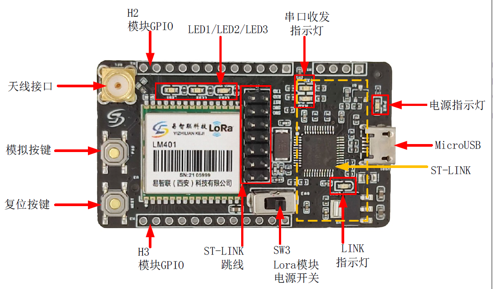

## 创建RT-Thread项目

    使用latest版本的RT-Thread，使用UART2（PA2,PA3）作为控制台串口。
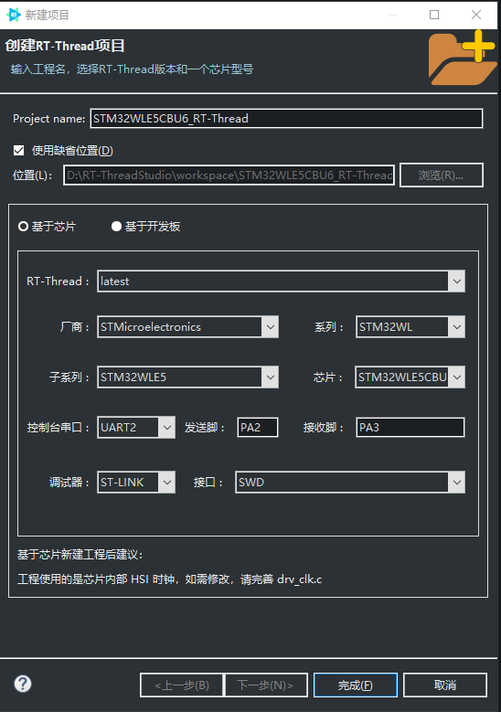

### 在进行对项目进行操作前，配置一下git，以便对项目可以进行管控跟踪

    首先，在github新建一个仓库，注意最好不要进行初始化配置，然后和本地仓库进行关联：
    以下是github官方给的建议操作：
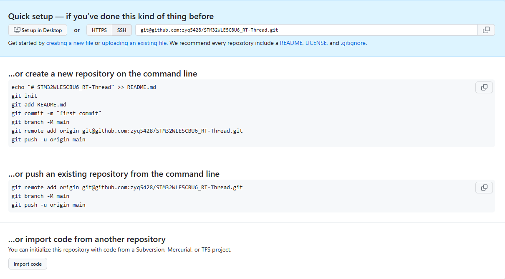
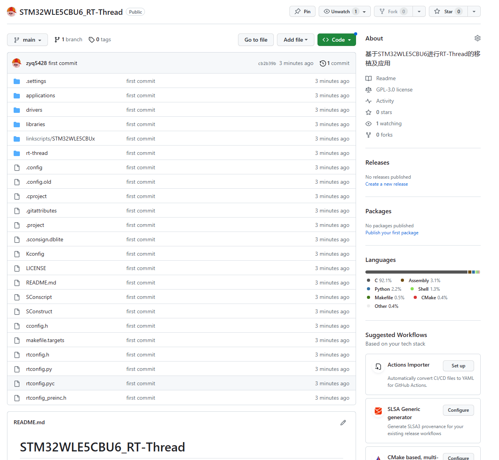

## 首次调试

    对项目进行重新构建，会发现官方模板无法正确编译，下面一一进行报错分析及解决。

### FPU报错

> 报错提示：#error "Compiler generates FPU instructions for a device without an FPU (check __FPU_PRESENT)"
> 问题分析：查询STM32WLE5手册，会发现该芯片是无FPU版本：
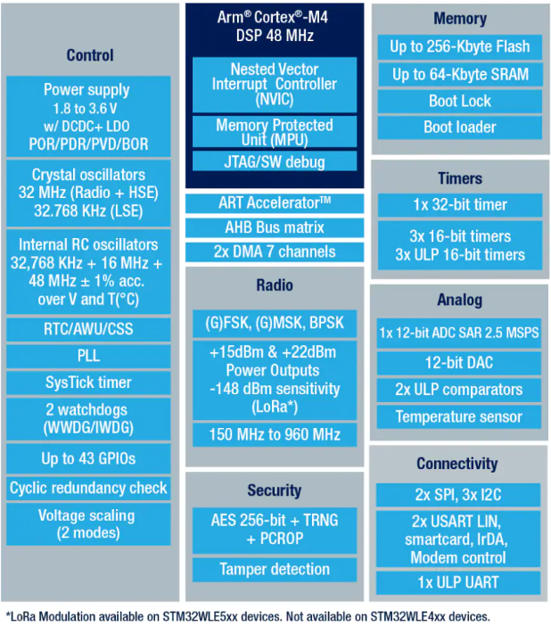
> 解决方案：在工程设置中关闭FPU功能，即可编译通过：
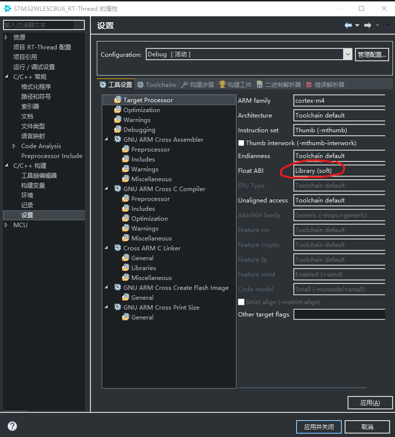

### 终端无输出

> 报错提示：串口终端没有信息打印。
> 问题分析：因为设置的打印串口为UART2，和自带的配置文件对不上，需要重新配置CubeMX。
> 解决方案：在CubeMX中设置好串口，时钟信息：
  > 选择外部晶振，并选择好Voltage scaling range和Flash Wait states (WS)，因为我要配置48MHz,所以根据参考手册中的说明，选择的Range 1和2 WS (3 HCLK cycles);
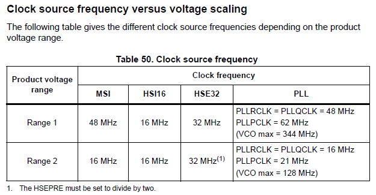
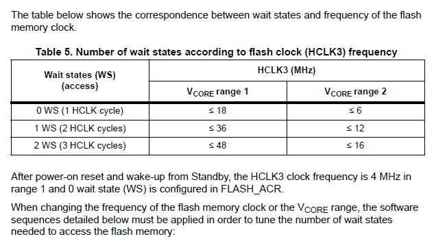
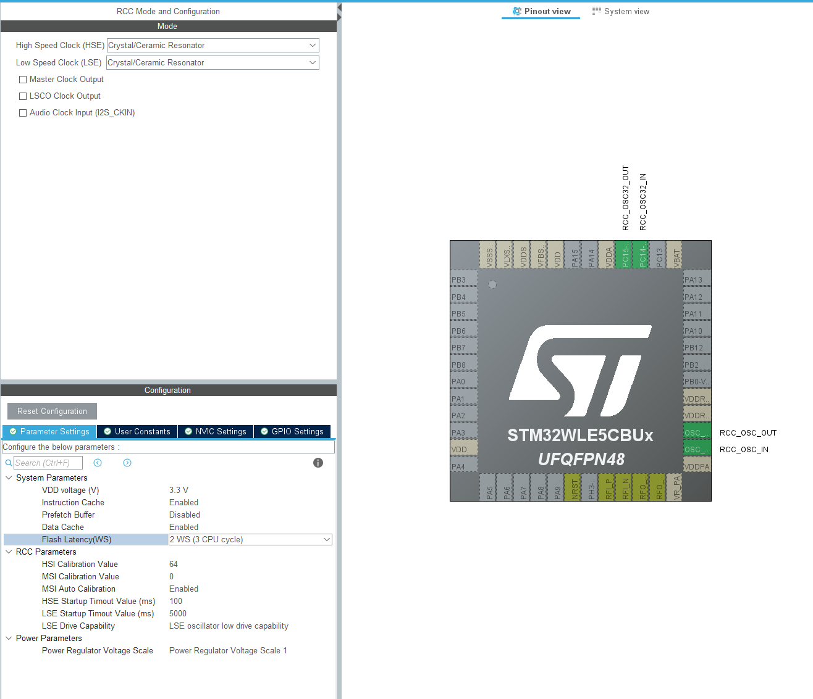
  > 开启UART，RTC等外设;
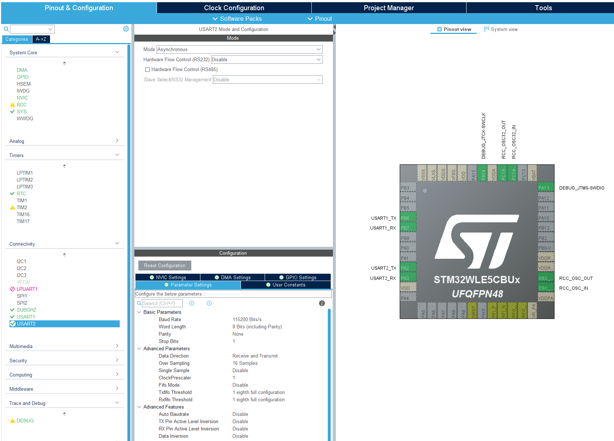
  > 配置时钟;
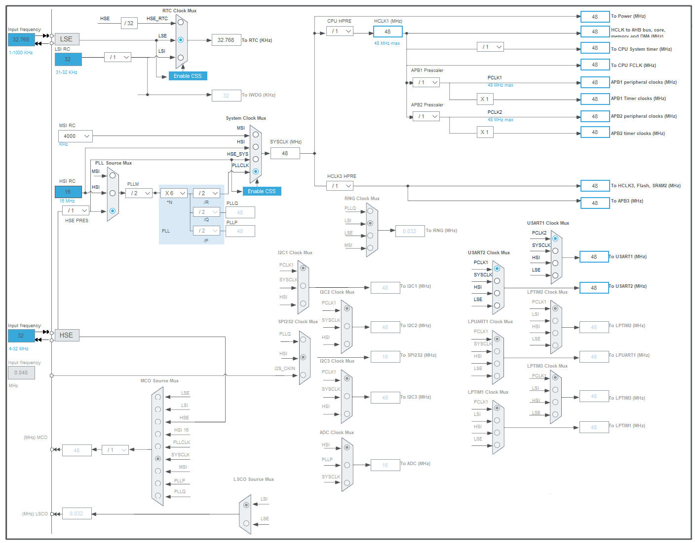
  > 生成代码后仅保留如下文件，并将cubemx添加到包含文件中：
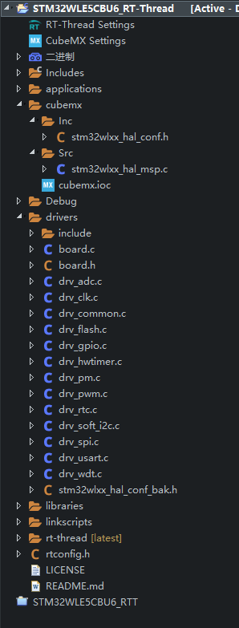
  > 在cubemx下配置Kconfig，以便使能相应的芯片功能和外设功。