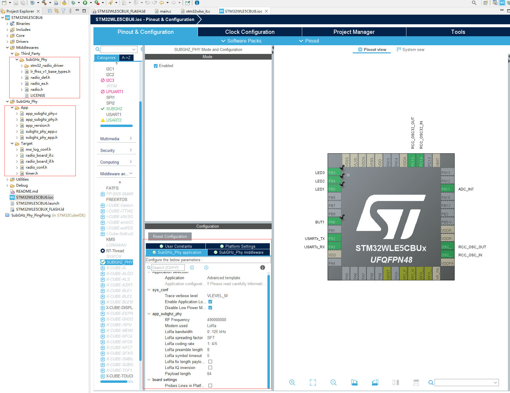
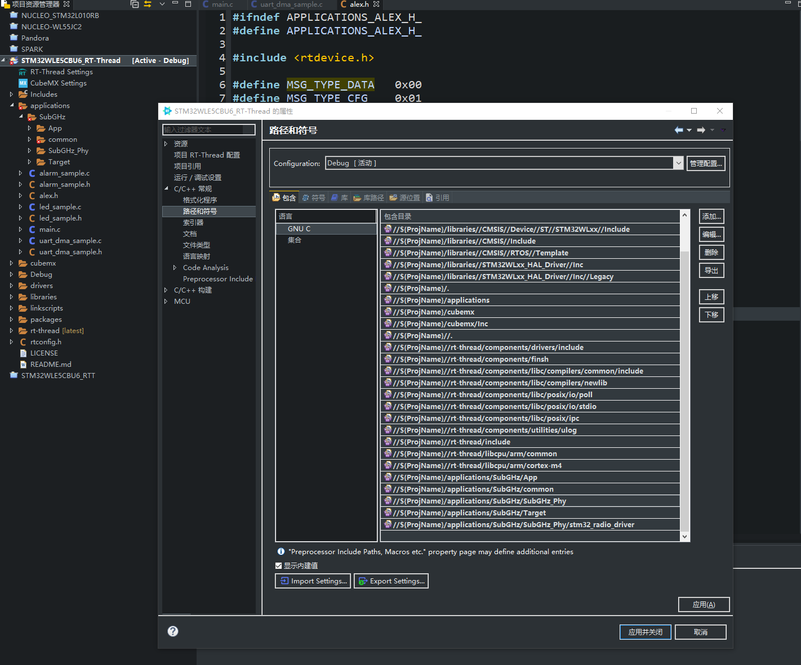
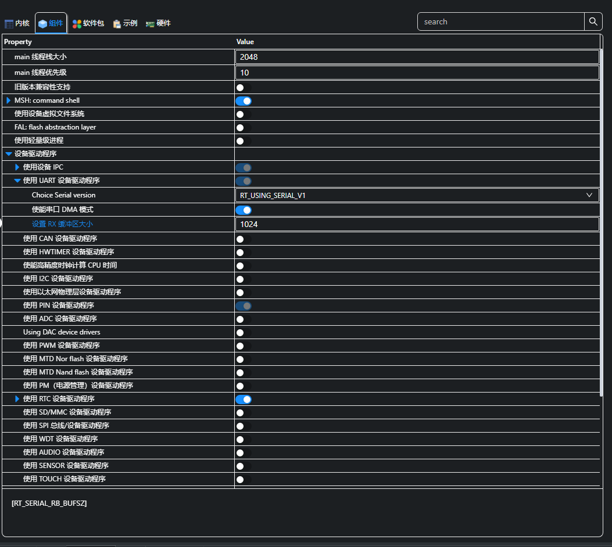
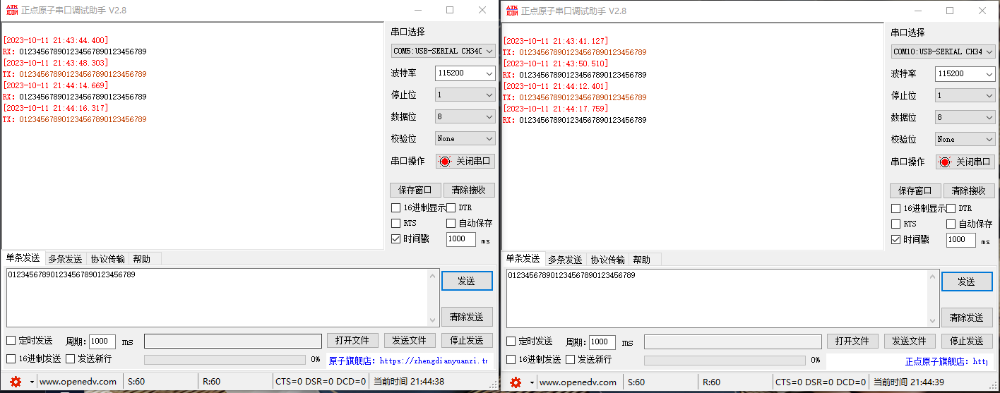

# STM32WL基于SubGHz实现无线透传

## 移植SubGHz驱动

* 首先基于STM32cubeIDE生成对应SubGHz配置文件：

* 然后打补丁，使用git apply --whitespace=fix patch.diff规避空格错误。

* 添加对应的路径：

* 增加RX缓冲区的大小为1024，因为UART的DMA Ringbuffer长度是基于这个定义的：

* SubGHz无线透传测试：
