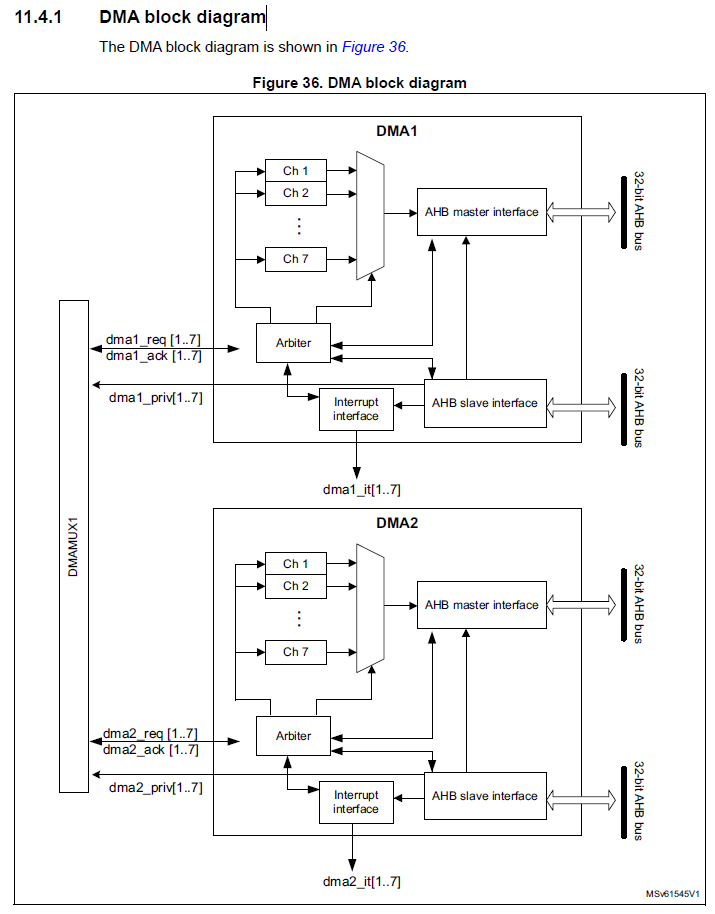
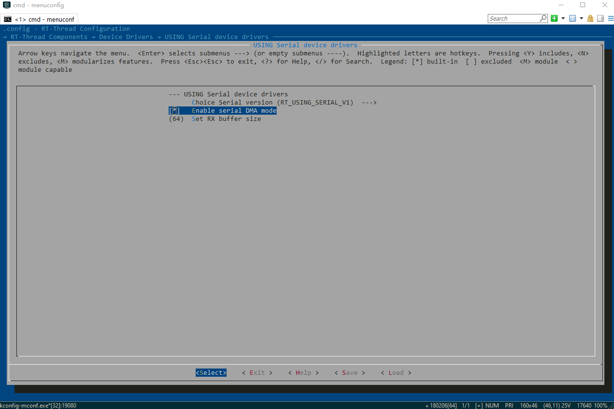
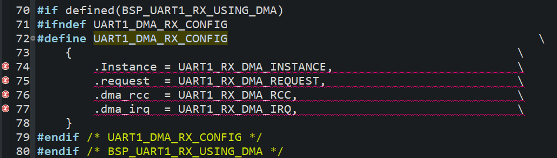
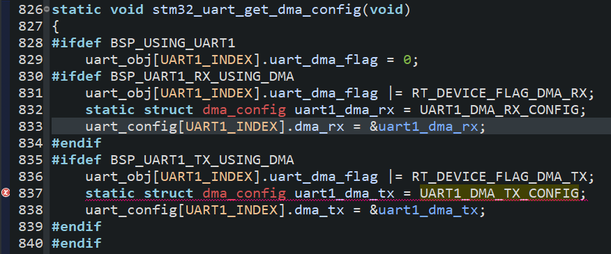
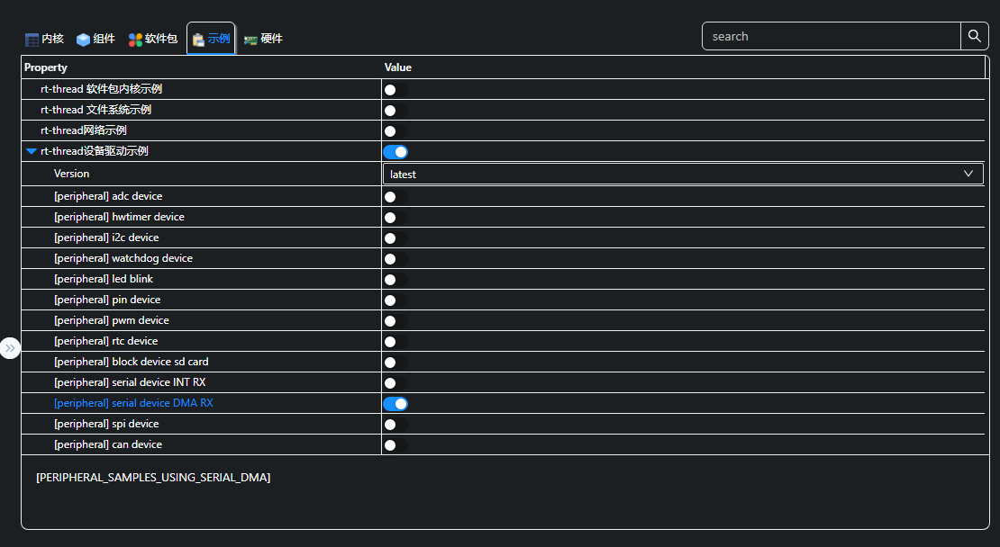
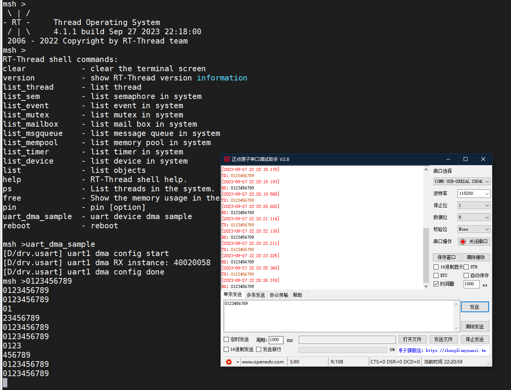
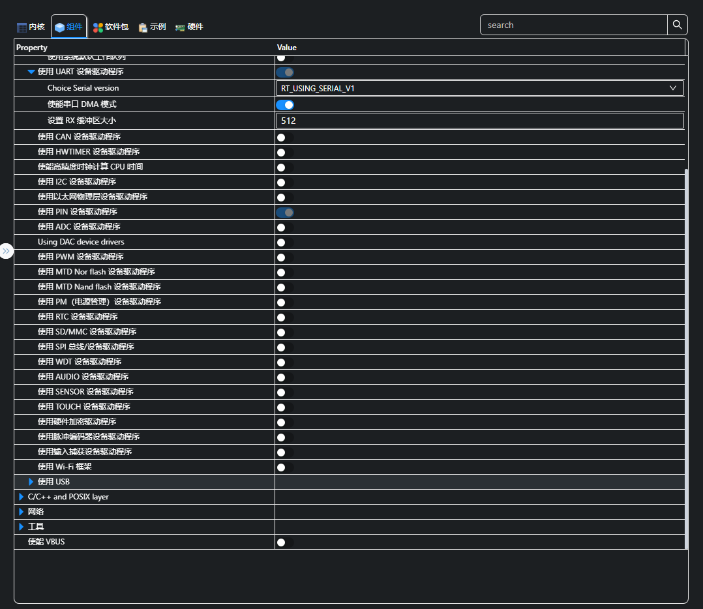
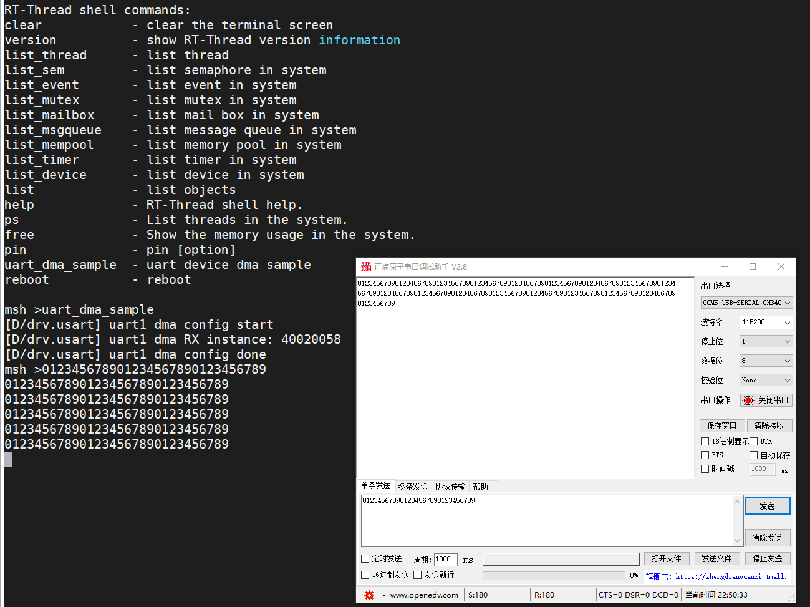

# STM32WL实现基于DMA的UART发送和接收

## DMA概述

DMA，全称Direct Memory Access，即直接存储器访问。
DMA用来提供在外设和存储器之间或者存储器和存储器之间的高速数据传输。无须CPU的干预，通过DMA数据可以快速地移动。这就节省了CPU的资源来做其他操作。

## STM23WLE5CB的DMA详细介绍

具备DMA1和DMA2，各有7个通道：


DMA传输方式：
* 方法1：DMA_Mode_Normal，正常模式，当一次DMA数据传输完后，停止DMA传送 ，也就是只传输一次。
* 方法2：DMA_Mode_Circular ，循环传输模式，当传输结束时，硬件自动会将传输数据量寄存器进行重装，进行下一轮的数据传输。 

仲裁器根据通道请求的优先级来启动外设/存储器的访问，优先权管理分2个阶段：
* 软件：每个通道的优先权可以在DMA_CCRx寄存器中设置，有4个等级：
  * 最高优先级
  * 高优先级
  * 中等优先级
  * 低优先级
* 硬件：如果2个请求有相同的软件优先级，则较低编号的通道比较高编号的通道有较高的优先权。比如：如果软件优先级相同，通道2优先于通道4。
* 注意： 在大容量产品和互联型产品中，DMA1控制器拥有高于DMA2控制器的优先级。

## 在RT-Thread中配置UART的DMA

### menuconfig中使能UART1及对应的DMA

首先要使能串口设备的DMA mode：


接着开启UART1,使能RX和TX的DMA：


### UART及DMA问题分析及解决方案

#### 提示未配置UART1引脚

> 报错提示：error: 'BSP_UART1_TX_PIN' undeclared here (not in a function)。
> 问题分析：没有配置UART1的TX和RX引脚所致。
> 解决方案：在board.h中配置即可：
```
#define BSP_USING_UART1
#define BSP_UART1_TX_PIN       "PB6"
#define BSP_UART1_RX_PIN       "PB7"
```

#### UART1_DMA_*X_CONFIG配置报错

> 报错提示：error: 'UART1_RX_DMA_INSTANCE' undeclared (first use in this function)。

> 问题分析：没有正确配置UART和DMA。
> 解决方案：
* 首先，在uart_config.h中包含dma_config.h：
```
#ifdef RT_SERIAL_USING_DMA
#include "dma_config.h"
#endif
```
* 其次，正确进行DMA配置：
```
/* DMA1 channel4 */
#if defined(BSP_UART1_TX_USING_DMA) && !defined(UART1_TX_DMA_INSTANCE)
#define UART1_DMA_TX_IRQHandler         DMA1_Channel4_IRQHandler
#define UART1_TX_DMA_RCC                RCC_AHB1ENR_DMA1EN
#define UART1_TX_DMA_INSTANCE           DMA1_Channel4
#define UART1_TX_DMA_REQUEST            DMA_REQUEST_USART1_TX//DMA_REQUEST_2
#define UART1_TX_DMA_IRQ                DMA1_Channel4_IRQn
/* DMA1 channel5 */
#if defined(BSP_UART1_RX_USING_DMA) && !defined(UART1_RX_DMA_INSTANCE)
#define UART1_DMA_RX_IRQHandler         DMA1_Channel5_IRQHandler
#define UART1_RX_DMA_RCC                RCC_AHB1ENR_DMA1EN
#define UART1_RX_DMA_INSTANCE           DMA1_Channel5
#define UART1_RX_DMA_REQUEST            DMA_REQUEST_USART1_RX//DMA_REQUEST_2
#define UART1_RX_DMA_IRQ                DMA1_Channel5_IRQn
```

#### UART1_DMA_TX_CONFIG未定义

> 报错提示：error: 'UART1_DMA_TX_CONFIG' undeclared (first use in this function)。

> 问题分析：RT-Thread移植不全，没有考虑UART的TX部分采用DMA。
> 解决方案：自行RX_DMA配置后添加UART1_DMA_TX_CONFIG 部分代码：
```
#if defined(BSP_UART1_RX_USING_DMA)
#ifndef UART1_DMA_RX_CONFIG
#define UART1_DMA_RX_CONFIG                                            \
    {                                                               \
        .Instance = UART1_RX_DMA_INSTANCE,                          \
        .request  = UART1_RX_DMA_REQUEST,                           \
        .dma_rcc  = UART1_RX_DMA_RCC,                               \
        .dma_irq  = UART1_RX_DMA_IRQ,                               \
    }
#endif /* UART1_DMA_RX_CONFIG */
#endif /* BSP_UART1_RX_USING_DMA */

#if defined(BSP_UART1_RX_USING_DMA)
#ifndef UART1_DMA_TX_CONFIG
#define UART1_DMA_TX_CONFIG                                            \
    {                                                               \
        .Instance = UART1_TX_DMA_INSTANCE,                          \
        .request  = UART1_TX_DMA_REQUEST,                           \
        .dma_rcc  = UART1_TX_DMA_RCC,                               \
        .dma_irq  = UART1_TX_DMA_IRQ,                               \
    }
#endif /* UART1_DMA_RX_CONFIG */
#endif /* BSP_UART1_RX_USING_DMA */
```

## UART的DMA实战

在解决上述问题后，就可以无报错通过编译了，现在我们开始进行UARTA的DMA实际操作。

### 启用官方的serial device DMA RX驱动示例

按照如下方式启用示例，然后将示例串口改为uart1：


进行调试，可以发现示例成功的实现了DMA接收，并且在启用了半满和全满中断：


我们进行代码逻辑跟踪发现，在RT-Thread的实现中，DMA的buf长度跟随RT_SERIAL_RB_BUFSZ，且参考手册中有说明数据长度范围为0~2^18-1:
``` {.line-numbers highlight=[9]}
#define RT_SERIAL_CONFIG_DEFAULT           \
{                                          \
    BAUD_RATE_115200, /* 115200 bits/s */  \
    DATA_BITS_8,      /* 8 databits */     \
    STOP_BITS_1,      /* 1 stopbit */      \
    PARITY_NONE,      /* No parity  */     \
    BIT_ORDER_LSB,    /* LSB first sent */ \
    NRZ_NORMAL,       /* Normal mode */    \
    RT_SERIAL_RB_BUFSZ, /* Buffer size */  \
    RT_SERIAL_FLOWCONTROL_NONE, /* Off flowcontrol */ \
    0                                      \
}
```

可以修改RT_SERIAL_RB_BUFSZ以降低半满和全满中断，尽量使用串口空闲中断，以保证一帧数据的完整性：




### 修改示例实现DMA发送

rt_device_open时可以配置设备的操作方式，进行添加即可：
``` {.line-numbers highlight=[9]}
    /* 以 DMA 接收及轮询发送方式打开串口设备 */
    rt_device_open(serial, RT_DEVICE_FLAG_DMA_RX | RT_DEVICE_FLAG_DMA_TX);
```

注意事项：使用DMA发送时，发送的数据一定不能是临时变量，以防止在发送过程中，变量的数据被更改，导致发送错误。