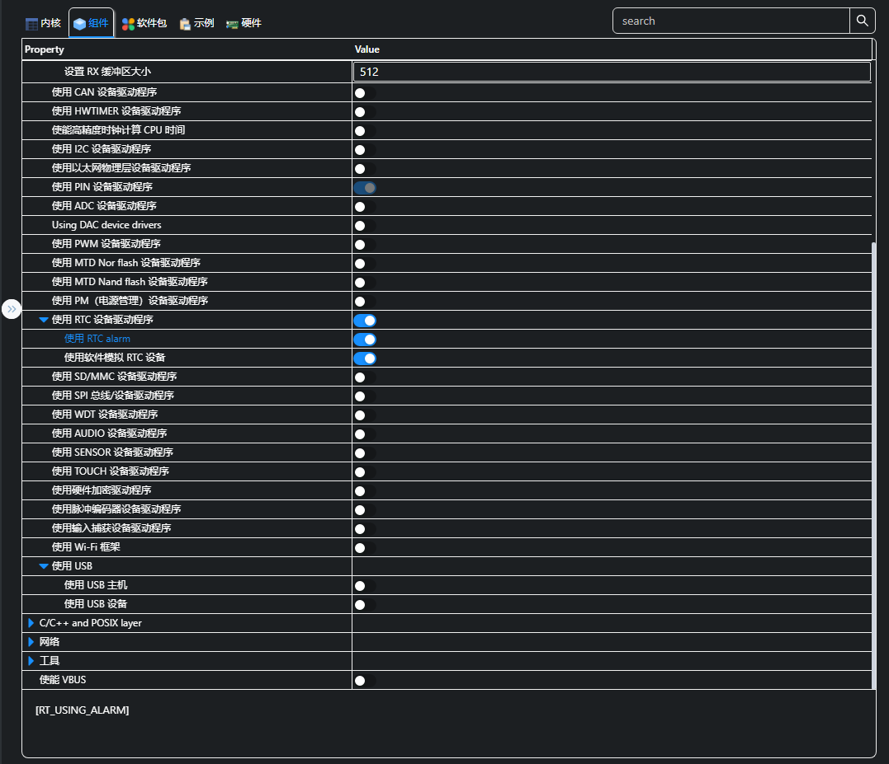
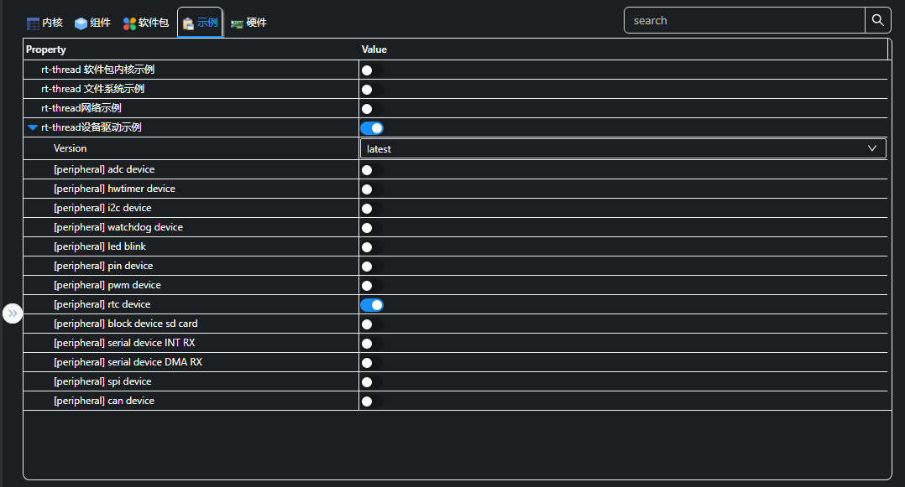
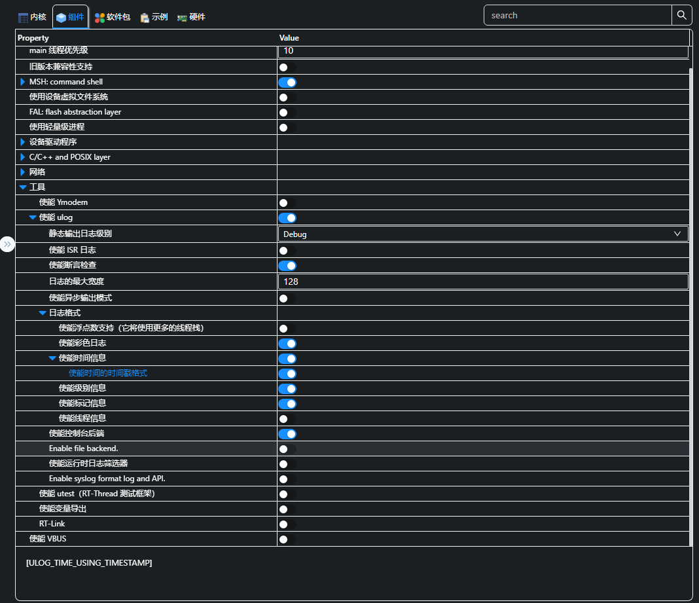
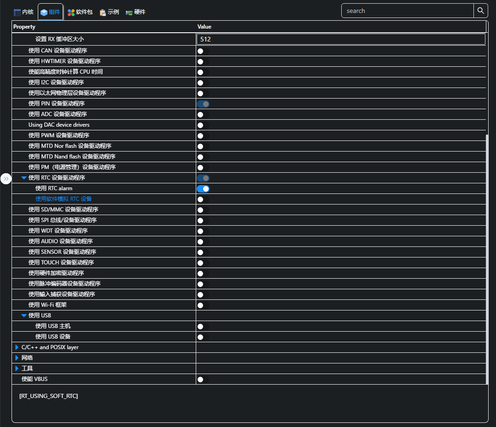
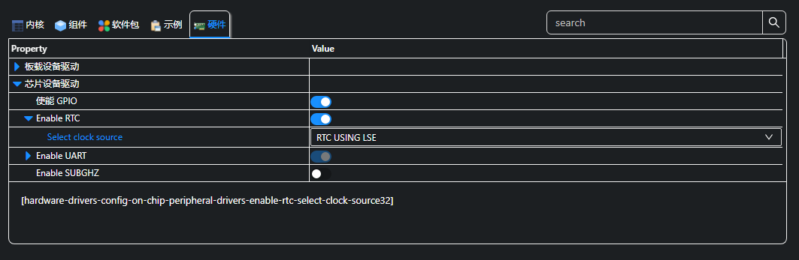
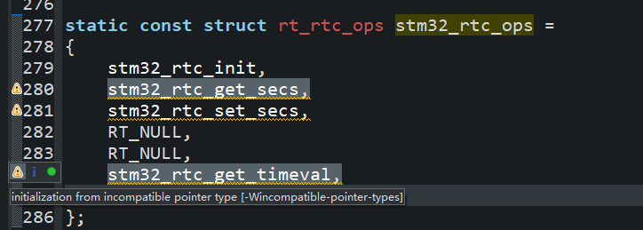
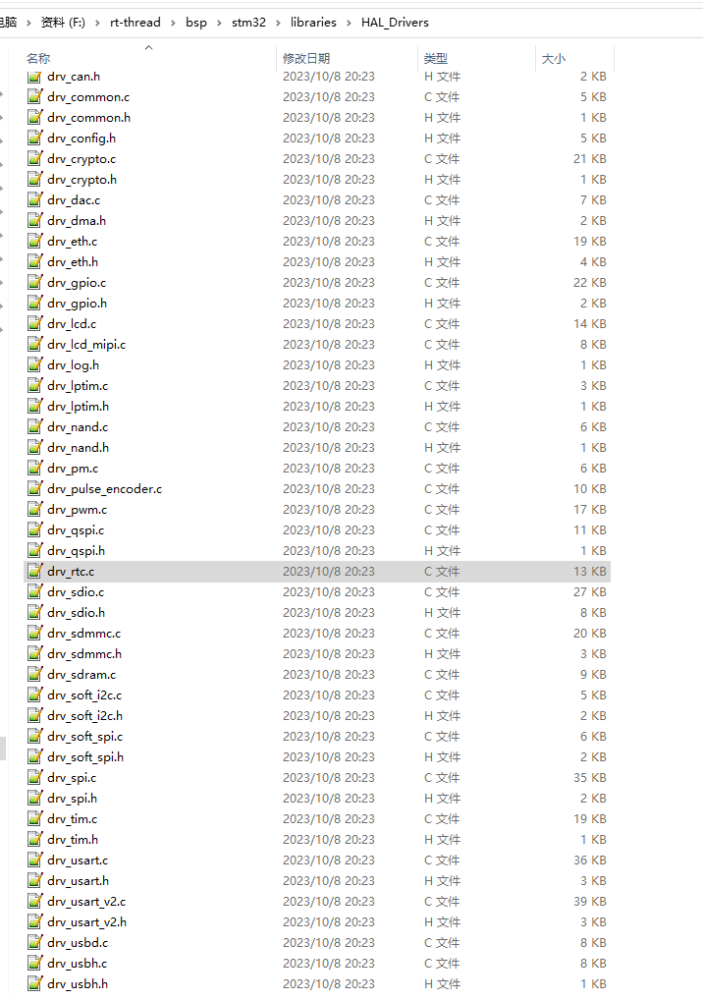

# STM32WL配置RTC

## STM32WL配置软件模拟RTC

* 组件设置中开启软件模拟RTC


* 启用RTC设备示例

``` c {.line-numbers highlight=[1]}
#include <rtthread.h>
#include <rtdevice.h>

static int rtc_sample(int argc, char *argv[])
{
    rt_err_t ret = RT_EOK;
    time_t now;

    /* 设置日期 */
    ret = set_date(2018, 12, 3);
    if (ret != RT_EOK)
    {
        rt_kprintf("set RTC date failed\n");
        return ret;
    }

    /* 设置时间 */
    ret = set_time(11, 15, 50);
    if (ret != RT_EOK)
    {
        rt_kprintf("set RTC time failed\n");
        return ret;
    }

    /* 延时3秒 */
    rt_thread_mdelay(3000);

    /* 获取时间 */
    now = time(RT_NULL);
    rt_kprintf("%s\n", ctime(&now));

    return ret;
}

msh >rtc_sample
Mon Dec  3 11:15:53 2018
```

## 开启ulog日志


``` {.line-numbers highlight=[5]}
 \ | /
- RT -     Thread Operating System
 / | \     4.1.1 build Oct  6 2023 23:27:12
 2006 - 2022 Copyright by RT-Thread team
msh >01-01 08:00:00 D/drv.usart: uart1 dma config start
01-01 08:00:00 D/drv.usart: uart1 dma RX instance: 40020058
01-01 08:00:00 D/drv.usart: uart1 dma config done
01-01 08:00:00 D/drv.usart: uart1 dma config start
01-01 08:00:00 D/drv.usart: uart1 dma TX instance: 40020044
01-01 08:00:00 D/drv.usart: uart1 dma config done
```

## STM32WL配置硬件RTC

在配置中关闭软件模拟RTC，并且使能硬件RTC：



### 硬件RTC问题分析及解决方案

#### 提示stm32_rtc_ops初始化类型错误


> 报错提示：warning: initialization from incompatible pointer type [-Wincompatible-pointer-types]。
> 问题分析：rt_rtc_ops结构体的成员函数定义和drv_rtc.c中自定义的函数定义的类型不匹配。
> 解决方案：在drv_rtc.c中按照以下进行参数的类型配置即可：
``` c
struct rt_rtc_ops
{
    rt_err_t (*init)(void);
    rt_err_t (*get_secs)(time_t *sec);
    rt_err_t (*set_secs)(time_t *sec);
    rt_err_t (*get_alarm)(struct rt_rtc_wkalarm *alarm);
    rt_err_t (*set_alarm)(struct rt_rtc_wkalarm *alarm);
    rt_err_t (*get_timeval)(struct timeval *tv);
    rt_err_t (*set_timeval)(struct timeval *tv);
};
```
解决完之后进行测试，可发现重启后时间仍然有效，说明使用的是硬件RTC：
```
msh >rtc_sample
Mon Dec  3 11:15:52 2018

msh >date 2023 10 7 21 19 00
old: Mon Dec  3 11:16:41 2018
now: Sat Oct  7 21:19:00 2023
msh >date
local time: Sat Oct  7 21:19:04 2023
timestamps: 1696684744
timezone: UTC+8
msh >reboot

 \ | /
- RT -     Thread Operating System
 / | \     4.1.1 build Oct  7 2023 21:17:11
 2006 - 2022 Copyright by RT-Thread team
msh >10-07 21:19:52 D/drv.usart: uart1 dma config start
10-07 21:19:52 D/drv.usart: uart1 dma RX instance: 40020058
10-07 21:19:52 D/drv.usart: uart1 dma config done
10-07 21:19:52 D/drv.usart: uart1 dma config start
10-07 21:19:52 D/drv.usart: uart1 dma TX instance: 40020044
10-07 21:19:52 D/drv.usart: uart1 dma config done

msh >date
local time: Sat Oct  7 21:20:00 2023
timestamps: 1696684800
timezone: UTC+8
msh >
```

## STM32WL配置Alarm

### Alarm简介

alarm闹钟功能是基于RTC设备实现的，根据用户设定的闹钟时间，当时间到时触发alarm中断，执行闹钟事件，在硬件上RTC提供的Alarm是有限的，RT-Thread将Alarm在软件层次上封装成了一个组件，原理上可以实现无限个闹钟，但每个闹钟只有最后一次设定有效。
注意：要使用Alarm组件，需要使用menuconfig配置打开Alarm组件功能，由于alarm 是基于RTC设备，因此RTC也需要打开，且需要实现RTC提供的ops接口中的set_alarm和get_alarm接口，具体实现过程请参考RTC驱动开发文档。
alarm组件开启位置 ： RT-Thread Components -> Device Drivers -> Using RTC alarm

### 参考官方例程实现Alarm
参考官方例程后alarm_sample如下：
``` c
/*
** 程序清单：这是一个 RTC 设备使用例程
** 程序功能：设置RTC时间，创建闹钟，模式：每秒触发，启动闹钟
**/

#include <rtthread.h>
#include <rtdevice.h>

#define DBG_TAG "alarm_sample"
#define DBG_LVL DBG_INFO
#include <rtdbg.h>

#define THREAD_PRIORITY         18
#define THREAD_STACK_SIZE       512
#define THREAD_TIMESLICE        10

static rt_thread_t tid = RT_NULL;

void user_alarm_callback(rt_alarm_t alarm, time_t timestamp)
{
    rt_kprintf("user alarm callback function.\n");
}

static void alarm_sample(void *parameter)
{
    rt_device_t device = RT_NULL;

    device = rt_device_find("rtc");
    if (!device)
    {
      LOG_E("find RTC failed!");
      return ;
    }

    struct rt_alarm_setup setup;
    struct rt_alarm * alarm = RT_NULL;
    static time_t now;
    struct tm p_tm;

    if (alarm != RT_NULL)
        return;

    /* 获取当前时间戳，并把下一秒时间设置为闹钟时间 */
    now = time(NULL) + 1;
    gmtime_r(&now,&p_tm);

    setup.flag = RT_ALARM_SECOND;
    setup.wktime.tm_year = p_tm.tm_year;
    setup.wktime.tm_mon = p_tm.tm_mon;
    setup.wktime.tm_mday = p_tm.tm_mday;
    setup.wktime.tm_wday = p_tm.tm_wday;
    setup.wktime.tm_hour = p_tm.tm_hour;
    setup.wktime.tm_min = p_tm.tm_min;
    setup.wktime.tm_sec = p_tm.tm_sec;

    alarm = rt_alarm_create(user_alarm_callback, &setup);
    if(RT_NULL != alarm)
    {
        rt_alarm_start(alarm);
    }
}

/* 线程的初始化 */
int alarm_sample_start(void)
{
    /* 创建线程，名称是thread，入口是thread_entry */
    tid = rt_thread_create("alarm",
                            alarm_sample,
                            RT_NULL,
                            THREAD_STACK_SIZE,
                            THREAD_PRIORITY,
                            THREAD_TIMESLICE);

    /* 如果获得线程控制块，启动这个线程  */
    if (tid != RT_NULL)
        rt_thread_startup(tid);
    else
        LOG_E("thread [%s] create failed");

    return RT_EOK;
}

```

运行后可见到配置了一个闹钟，但没有生效，原因就是未实现set_alarm和get_alarm接口。
```
msh >list_alarm
| hh:mm:ss | week | flag | en |
+----------+------+------+----+
| 14:02:30 |   6  |   S  |  1 |
+----------+------+------+----+
msh >date
local time: Sat Oct  7 22:07:29 2023
timestamps: 1696687649
timezone: UTC+8
msh >date
local time: Sat Oct  7 22:08:02 2023
timestamps: 1696687682
timezone: UTC+8
msh >
```

```
    ret = rt_device_control(device, RT_DEVICE_CTRL_RTC_SET_ALARM, &wkalarm);
    if ((ret == RT_EOK) && wkalarm.enable)
    {
        ret = rt_device_control(device, RT_DEVICE_CTRL_RTC_GET_ALARM, &wkalarm);
        if (ret == RT_EOK)
        {
            /*
              some RTC device like RX8025,it's alarms precision is 1 minute.
              in this case,low level RTC driver should set wkalarm->tm_sec to 0.
            */
            alarm->wktime.tm_sec = wkalarm.tm_sec;
            alarm->wktime.tm_min = wkalarm.tm_min;
            alarm->wktime.tm_hour = wkalarm.tm_hour;
        }
    }
```

处理方案：在BSP中直接调用最新的drv_rtc.c，稍微修改即可：


**注意**：最好不要使能秒级闹钟，因为函数调用及线程切换等原因，可能会导致异常情况。
