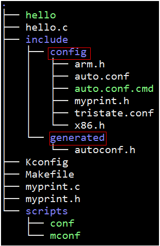

# 浅析Kbuild系统

> Kbuild： the Linux Kernel Build System
Linux内核采用统一的代码基础，却可以在大到服务器，小到微型的嵌入式设备上使用，其高度可裁剪、可定制化的构建在业界都是一流的。Linux在2.6版本之后采取了Kbuild系统进行系统的配置和构建。在新的构建系统下，首先编译系统会读取Linux内核顶层的 Makefile，然后根据读到的内容第二次读取Kbuild Makefile来编译Linux内核。
>
> 从配置和编译Linux Kernel所使用的命令来看，Linux Kernel的配置和编译体系总体上还是基于GNU Make的，没有另外使用其他的编译工具(比如Scons、CMake等)。但Linux Kernel实现了Kconfig和Kbuild，用于辅助内核的配置和编译。Kconfig，顾名思义就是Linux内核的配置(Kernel config)，Kbuild系统需要与Kconfig配合使用。
>
> 长篇的描述网上已经很多了，这里描述一下如何搭建和使用一个简要的Kbuild系统。

## 搭建Kbuild

> The Linux Kernel Build System has four main components:
>
> 1. Config symbols: compilation options that can be used to compile code conditionally in source files and to decide which objects to include in a kernel image or its modules.
>
> 2. Kconfig files: define each config symbol and its attributes, such as its type, description and dependencies. Programs that generate an option menu tree (for example, make menuconfig) read the menu entries from these files.
>
> 3. .config file: stores each config symbol's selected value. You can edit this file manually or use one of the many make configuration targets, such as menuconfig and xconfig, that call specialized programs to build a tree-like menu and automatically update (and create) the .config file for you.
>
> 4. Makefiles: normal GNU makefiles that describe the relationship between source files and the commands needed to generate each make target, such as kernel images and modules.

> **我们先不管抽象的定义，搭建的时候会有相应的文件对应到上面四个components。**

## 目录结构

> 创建一个目录结构如下，里面建立2个文件夹，其中include下必须手动建立config和generated文件夹，其中的文件都是自动生成的，不用考虑添加。scripts文件夹下的两个可执行文件拷贝自linux目录下的 **./scripts/kconfig/**。



> 剩余需要手动添加的文件为**hello.c, Kconifg, Makefile, myprint.c**

### hello.c

> 条件编译各种输出结果，Kbuild系统可以自动生成条件编译的宏，这些宏包含在autoconf.h里，进而控制生成的程序。

```c {.line-numbers highlight=[5]}
#include<stdio.h>
#include"autoconf.h"
#include"myprint.h"

void main() {
#ifdef CONFIG_ARM
	printf("ARM PLAT!\n");
#endif

#ifdef CONFIG_x86
	printf("x86 PLAT!\n");
#endif

#ifdef CONFIG_MYPRINT
	myprint();
#endif
}
```

### myprint.c

> 很简单的代码，头文件就是声明一下这个函数而已，不再列出。

```c {.line-numbers highlight=[3]}
#include <stdio.h>

void myprint(void) {
	printf("This is mytest!\n");
}
```

### Kconfig文件

> 使用Kbuild通常是这个过程。
>
> 1. make *config，比如menuconfig, defconfig
> 2. make 程序会读取目录树下的Kconfig文件，以 GUI 或者命令行的方式获得用户的配置，这一步会生成一个 .config 文件。
> 3. 运行 Kbuild 提供的 conf 程序，生成 config 和 generated 下的各个文件。
> 4. 用户使用的时候包含其中的 autoconf.h 即可。

> Kconfig的语法可以参考linux目录下**Documentation/kbuild/kconfig-language.txt**

``` {.line-numbers highlight=[3]}
#include <stdio.h>

void myprint(void) {
	printf("This is mytest!\n");
}
```

### Makefile

> Makefile里使用宏CONFIG_XXX来控制是否包含相应的目标。
这些宏包含在auto.conf里，由Kbuild系统自动生成。

``` {.line-numbers highlight=[3]}
TARGET=hello

-include ./include/config/auto.conf

LDFLAGS= -I ./include/generated

obj-y := hello.c
obj-$(CONFIG_MYPRINT) += myprint.c

all:$(TARGET)
$(TARGET):$(obj-y) FORCE
	gcc $(LDFLAGS) -o $@ $(obj-y)
	echo $@
	echo $(obj-y)
defconfig:
	./scripts/conf Kconfig
	./scripts/conf -s --syncconfig Kconfig
menuconfig:
	./scripts/mconf Kconfig
	./scripts/conf -s --syncconfig Kconfig
clean:
	rm $(TARGET)

PHONY +=FORCE
FORCE:

.PHONY: $(PHONY)
```

### 运行 make defconfig

``` {.line-numbers highlight=[1, 17, 32]}
hero@debian:~/kbuild_learn$ tree
.
├── hello.c
├── hello.c~
├── include
│   ├── config
│   └── generated
├── Kconfig
├── Makefile
├── myprint.c
├── myprint.h
└── scripts
    ├── conf
    └── mconf

4 directories, 8 files
hero@debian:~/kbuild_learn$ make defconfig
./scripts/conf Kconfig
*
* Kbuild Test Configuration
*
*
* TEST_KBUILD
*
enable gcc arm (ARM) [N/y/?] (NEW) n
enable gcc x86 (x86) [N/y/?] (NEW) y
enable myprint.c (MYPRINT) [N/y/?] (NEW) y
#
# configuration written to .config
#
./scripts/conf -s --syncconfig Kconfig
hero@debian:~/kbuild_learn$ tree
.
├── hello.c
├── hello.c~
├── include
│   ├── config
│   │   ├── auto.conf
│   │   ├── auto.conf.cmd
│   │   ├── myprint.h
│   │   ├── tristate.conf
│   │   └── x86.h
│   └── generated
│       └── autoconf.h
├── Kconfig
├── Makefile
├── myprint.c
├── myprint.h
└── scripts
    ├── conf
    └── mconf

4 directories, 14 files
hero@debian:~/kbuild_learn$
```

> 配置写到了.config文件中。

```
#
# Automatically generated file; DO NOT EDIT.
# Kbuild Test Configuration
#

#
# TEST_KBUILD
#
CONFIG_ARM=y
CONFIG_x86=y
# CONFIG_MYPRINT is not set
```

> **include/config/auto.conf**文件内容和 **.config**内容并无二致。把不是y的以及冗余的信息删除了而已.

```
#
# Automatically generated file; DO NOT EDIT.
# Kbuild Test Configuration
#
CONFIG_x86=y
CONFIG_ARM=y
```

> **include/generated/autoconf.h**文件内容

```
/*
 *
 * Automatically generated file; DO NOT EDIT.
 * Kbuild Test Configuration
 *
 */
#define CONFIG_x86 1
#define CONFIG_ARM 1
```

> 配合代码里的条件编译选项，就能控制生成的代码了。

## 总结

> 总结一下Kbuild系统包含的四个components。
>
> * Config symbols: autoconf.h
> * Kconfig files: Kconfig
> * .config file: .config
> * Makefiles: Makefile
