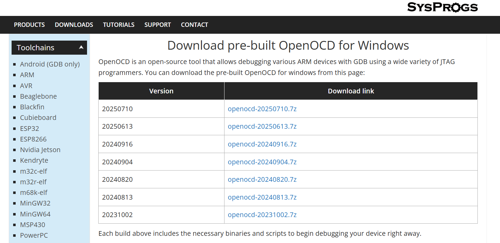
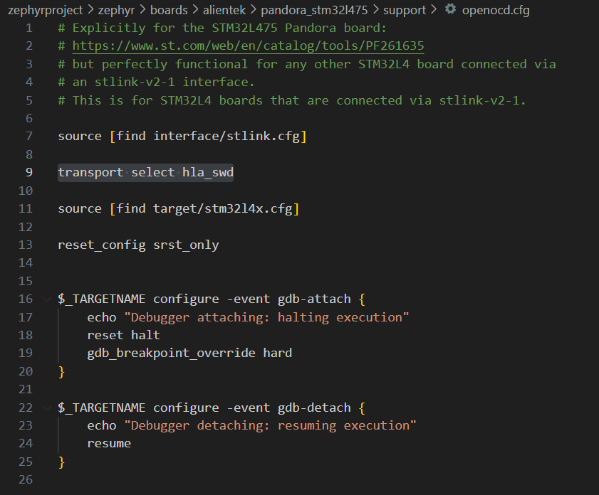

# 入门指南

## 操作环境

    我的操作环境是
    * Windows 10 专业版
    * 潘多拉 STM32L475 开发板（pandora_stm32l475）
    * Windows Terminal命令行
    * Zephyr版本(v4.2.0-7073-g2cce5ed488f)

## 搭建工作环境

可以参考以下链接操作：[Getting Started Guide](https://docs.zephyrproject.org/latest/develop/getting_started/index.html)。

建议：在搭建环境时，最好使用工具，然后使用代理：

``` 
(.venv) PS E:\zephyrproject\zephyr> $env:http_proxy="http://127.0.0.1:10808"
(.venv) PS E:\zephyrproject\zephyr> $env:https_proxy="http://127.0.0.1:10808"
```

## 异常处理

### west flash无法找到openocd

在以下链接[OpenOCD](https://gnutoolchains.com/arm-eabi/openocd/)下载最新的openocd，然后添加到系统变量path中：



### west flash transport 不支持 hla_swd (如果出现)

    修改boards的openocd.cfg：
    修改前：

    修改后：
``` 
# Explicitly for the STM32L475 Pandora board:
# https://www.st.com/web/en/catalog/tools/PF261635
# but perfectly functional for any other STM32L4 board connected via
# an stlink-v2-1 interface.
# This is for STM32L4 boards that are connected via stlink-v2-1.

source [find interface/stlink.cfg]

transport selecthla_swd

source [find target/stm32l4x.cfg]

reset_config srst_only


$_TARGETNAME configure -event gdb-attach {
    echo "Debugger attaching: halting execution"
    reset halt
    gdb_breakpoint_override hard
}

$_TARGETNAME configure -event gdb-detach {
    echo "Debugger detaching: resuming execution"
    resume
}

```

## prj.conf配置

使用以下命令启动图形化配置命令，然后进行配置，保存完后在对应位置打开.conf文件(.\build\zephyr\.conf)，配合AI，提取你所需要的配置，注意检查AI是否增加自己的想法，并进行核对。此举主要的目的是让你可以获取CONFIG_XXX这些名称，避免出错。

```
west build -b pandora_stm32l475 -t menuconfig ..\application
```

展示一下我pandora_stm32l475的初始配置：
```
#
# 1. Subsystems: Shell and Console (外壳与控制台)
#
# 启用 Shell 子系统
CONFIG_SHELL=y
# 启用 Shell 后端支持
CONFIG_SHELL_BACKENDS=y
# 使用串口作为 Shell 的 I/O 接口
CONFIG_SHELL_BACKEND_SERIAL=y
# 启用控制台输入处理
CONFIG_CONSOLE_HANDLER=y
# 指定 UART 作为控制台设备
CONFIG_UART_CONSOLE=y
# 启用 UART 运行时配置更改
CONFIG_UART_USE_RUNTIME_CONFIGURE=y
# 控制台最大输入行长度
CONFIG_CONSOLE_INPUT_MAX_LINE_LEN=128
# 增加 Shell 线程栈大小以确保稳定运行
CONFIG_SHELL_STACK_SIZE=2048

#
# 2. Logging System (日志系统)
#
# 启用核心日志功能
CONFIG_LOG=y
# 启用延迟模式（使用队列，提高实时性能）
CONFIG_LOG_MODE_DEFERRED=y
# 使用 UART 作为日志输出后端
CONFIG_LOG_BACKEND_UART=y
# 默认日志级别设置为 Info (3)
CONFIG_LOG_DEFAULT_LEVEL=3
# 编译时包含的最大日志级别设置为 Debug (4)
CONFIG_LOG_MAX_LEVEL=4

#
# 3. Core Drivers: Serial/UART (核心驱动：串行/UART)
#
# 启用串行子系统
CONFIG_SERIAL=y
# 启用中断驱动模式 (高效)
CONFIG_UART_INTERRUPT_DRIVEN=y

#
# 4. Core Drivers: GPIO (通用输入/输出)
#
# 启用 GPIO 核心支持
CONFIG_GPIO=y
# 启用 STM32 硬件 GPIO 驱动
CONFIG_GPIO_STM32=y

#
# 5. Core Drivers: I2C
#
# 启用 I2C 核心支持
CONFIG_I2C=y
# 启用 STM32 硬件 I2C 驱动
CONFIG_I2C_STM32=y
# 启用中断驱动模式
CONFIG_I2C_STM32_INTERRUPT=y

#
# 6. Core Drivers: QSPI/Flash (W25Q128)
#
# 启用 Flash API 核心支持
CONFIG_FLASH=y
# 启用使用 STM32 HAL 库实现的 QSPI 驱动
CONFIG_FLASH_STM32_QSPI=y

#
# 7. Core Drivers: Standard SPI
#
# 启用标准 SPI 核心支持 (如果需要连接 SPI 传感器/屏幕)
CONFIG_SPI=y

#
# 8. Core Drivers: RTC (实时时钟)
#
# 启用 RTC 核心支持
CONFIG_RTC=y
# 启用 STM32 硬件 RTC 驱动
CONFIG_RTC_STM32=y
# 启用 RTC 闹钟功能
CONFIG_RTC_ALARM=y

#
# 9. Core Drivers: LED (发光二极管)
#
# 启用 LED 核心驱动框架
CONFIG_LED=y
# 启用 GPIO LED 驱动 (用于开关控制)
CONFIG_LED_GPIO=y
# 启用 PWM LED 驱动 (用于亮度调节)
CONFIG_LED_PWM=y

#
# 10. Core Drivers: Pin Controller and HW Info (引脚控制器与硬件信息)
#
# 启用引脚控制器核心支持
CONFIG_PINCTRL=y
# 启用 STM32 引脚控制器驱动
CONFIG_PINCTRL_STM32=y
# 启用硬件信息核心支持
CONFIG_HWINFO=y
# 启用 STM32 硬件信息驱动 (读取芯片ID等)
CONFIG_HWINFO_STM32=y

#
# 11. Kernel & System (内核与系统基础)
#
# 定义系统时钟滴答的频率
CONFIG_SYS_CLOCK_TICKS_PER_SEC=1000
# 启用 DMA 核心支持
CONFIG_DMA=y
# 启用 Newlib C 库
CONFIG_NEWLIB_LIBC=y
# 启用标准输出重定向到控制台
CONFIG_STDOUT_CONSOLE=y
```