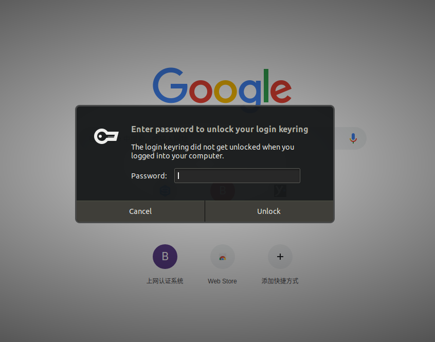
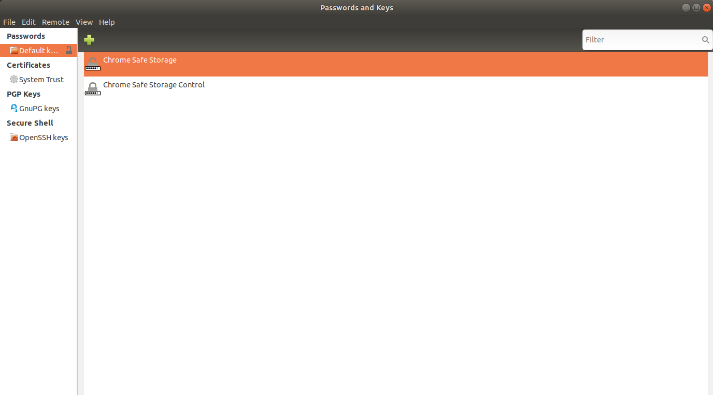

# ubuntu 18.04 谷歌浏览器enter password to unlock your login keyring

## 删除文件方法



``` {.line-numbers highlight=[1, 3]}
hero@hero:~$ find ~/ -name login.keyring
/home/hero/.local/share/keyrings/login.keyring
hero@hero:~$ sudo rm -rf /home/hero/.local/share/keyrings/login.keyring
[sudo] password for hero:
hero@hero:~$
```

> 再次打开谷歌浏览器
> 提示设置密码,确定即可,之后应该不会再弹出这种提示了.

## 设置选项

> * 在搜索中打开 密码和密钥
> * 密码项中存在 “Chrome Safe Storage Control” 等两项密钥，删除掉
> * 再次进入 chrome 时会提示设置初始密码，什么都不输入点击 确定
> * 从此在也不用输入密码了

Passwords_and_Keys

