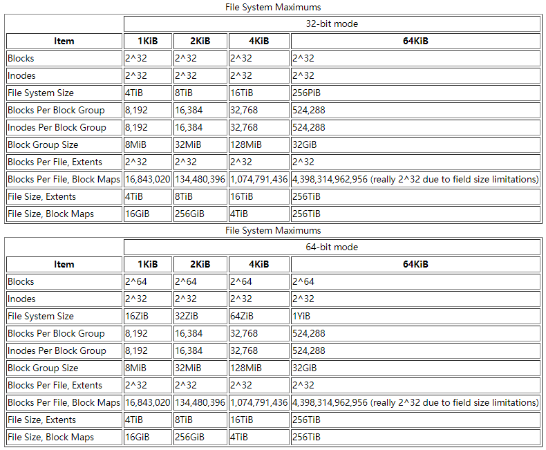
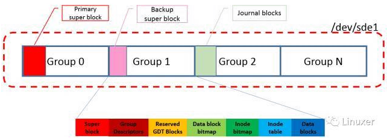
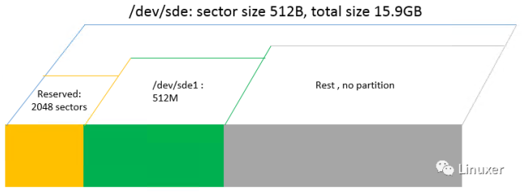
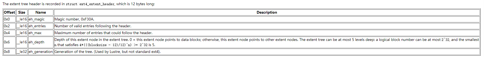
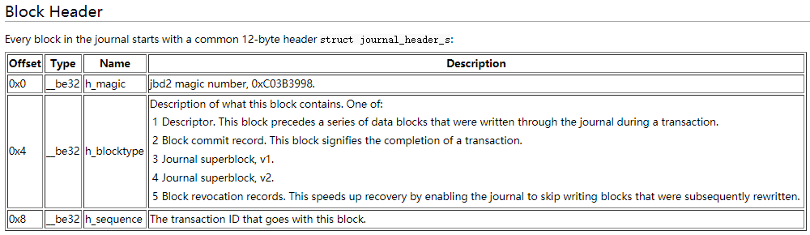
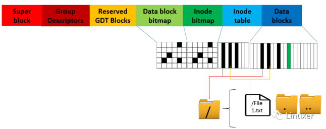
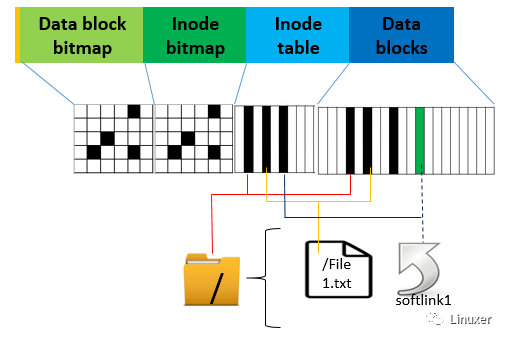

# Ext4 Disk Layout

> Ext4 的blocks大小通常为4KiB，每个block groups包含32768的块，长度为128MiB。block groups的数量是设备的大小除以块组的大小。ext4中的所有字段都以little-endian顺序写入磁盘。但是，jbd2（日志）中的所有字段都以big-endian顺序写入磁盘。

## Blocks



## Layout

> 标准block group的布局分布如下：

| Group 0 Padding | ext4 Super Block | Group Descriptors | Reserved GDT Blocks | Data Block Bitmap | inode Bitmap | inode Table | Data Blocks |
|:---:|:---:|:---:|:---:|:---:|:---:|:---:|:---:|
| 1024 bytes | 1 block | many blocks | many blocks | 1 block | 1 block | many blocks | many more blocks|



> 在 mkfs.ext4命令格式化完块设备以后,ext4的layout在块设备上大致如上图所描述, 包含了一下信息:
>
> * 块设备被按group 来划分,每个group有对应的group deor
> * Super block在Group 0中, 非group 0中的super block是backup super block
> * Journal block的位置并不是在最后一个group.(本例中,journal block在group 2)

## 定位文件系统超级块superblock

> 首先, 如果磁盘是DOS的分区格式, 那就用fdisk命令查看一下磁盘的分区信息. 从磁盘的分区信息我们可以得到以下内容:
>
> * 整个磁盘有多大
> * 磁盘被分成了多少个分区
> * 每个分区的大小和起始结束的位置

``` {.line-numbers}
hero@debian:~$ lsblk
NAME   MAJ:MIN RM  SIZE RO TYPE MOUNTPOINT
sda      8:0    0  150G  0 disk 
├─sda1   8:1    0  146G  0 part /
├─sda2   8:2    0    1K  0 part 
└─sda5   8:5    0    4G  0 part [SWAP]
sdb      8:16   1 14.5G  0 disk 
└─sdb1   8:17   1 14.4G  0 part 
sr0     11:0    1 1024M  0 rom  
hero@debian:~$ sudo fdisk -l /dev/sdb1 
[sudo] password for hero: 
Disk /dev/sdb1: 14.4 GiB, 15418261504 bytes, 30113792 sectors
Units: sectors of 1 * 512 = 512 bytes
Sector size (logical/physical): 512 bytes / 512 bytes
I/O size (minimum/optimal): 512 bytes / 512 bytes
Disklabel type: dos
Disk identifier: 0x500a0dff

Device      Boot      Start        End    Sectors   Size Id Type
/dev/sdb1p1      1948285285 3650263507 1701978223 811.6G 6e unknown
/dev/sdb1p2               0          0          0     0B 74 unknown
/dev/sdb1p4        28049408   28049848        441 220.5K  0 Empty

Partition table entries are not in disk order.
```

> 这是OK6410 **SD_Writer.exe** 制作的SD卡启动卡。现在格式化SD卡为Ext4格式。

``` {.line-numbers}
hero@debian:~$ sudo fdisk /dev/sdb

Welcome to fdisk (util-linux 2.29.2).
Changes will remain in memory only, until you decide to write them.
Be careful before using the write command.


Command (m for help): p
Disk /dev/sdb: 14.5 GiB, 15523119104 bytes, 30318592 sectors
Units: sectors of 1 * 512 = 512 bytes
Sector size (logical/physical): 512 bytes / 512 bytes
I/O size (minimum/optimal): 512 bytes / 512 bytes
Disklabel type: dos
Disk identifier: 0xda91aa07

Device     Boot Start      End  Sectors  Size Id Type
/dev/sdb1        2048 30115839 30113792 14.4G  c W95 FAT32 (LBA)

Command (m for help): d
Selected partition 1
Partition 1 has been deleted.

Command (m for help): n
Partition type
   p   primary (0 primary, 0 extended, 4 free)
   e   extended (container for logical partitions)
Select (default p): p
Partition number (1-4, default 1): 1
First sector (2048-30318591, default 2048): 2048
Last sector, +sectors or +size{K,M,G,T,P} (2048-30318591, default 30318591): 

Created a new partition 1 of type 'Linux' and of size 14.5 GiB.
Partition #1 contains a vfat signature.

Do you want to remove the signature? [Y]es/[N]o: Y

The signature will be removed by a write command.

Command (m for help): w
The partition table has been altered.
Calling ioctl() to re-read partition table.
Syncing disks.
```

> 上述fdisk的命令可以百度查看，是常用新建分区的一系列操作。
>
> **对于为什么第一个分区从2048扇区（2048*521/(1024*1024)=1M）开始**，解答如下：
>
> * With the death of the legacy BIOS (ok, its not quite dead yet) and its replacement with EFI BIOS, a special boot partitionis needed to allow EFI systems to boot in EFI mode.
Starting the first partition at sector 2048 leaves 1Mb for the EFI boot code. Modern partitioning tools do this anyway and fdisk has been updated to follow suit.
随着传统BIOS的死亡（不确定，它还没有完全死亡）并且用EFI BIOS替代它，需要一个特殊的启动分区来允许EFI系统以EFI模式启动。
在扇区2048处启动第一个分区会留下1Mb用于EFI引导代码。 现代分区工具无论如何都会这样做，并且fdisk已经更新。
>
> 接下来格式化为Ext4文件系统：

``` {.line-numbers}
hero@debian:~$ ls /dev/sdb*
/dev/sdb  /dev/sdb1
hero@debian:~$ sudo mke2fs -t ext4 -L "testdisk" /dev/sdb1
[sudo] password for hero:
mke2fs 1.43.4 (31-Jan-2017)
Creating filesystem with 3789568 4k blocks and 948416 inodes
Filesystem UUID: d7813e76-c94d-4220-a6c2-85b9f0aa4feb
Superblock backups stored on blocks:
	32768, 98304, 163840, 229376, 294912, 819200, 884736, 1605632, 2654208

Allocating group tables: done                            
Writing inode tables: done                            
Creating journal (16384 blocks): done
Writing superblocks and filesystem accounting information: done

hero@debian:~$ sudo fdisk -l /dev/sdb
Disk /dev/sdb: 14.5 GiB, 15523119104 bytes, 30318592 sectors
Units: sectors of 1 * 512 = 512 bytes
Sector size (logical/physical): 512 bytes / 512 bytes
I/O size (minimum/optimal): 512 bytes / 512 bytes
Disklabel type: dos
Disk identifier: 0xda91aa07

Device     Boot Start      End  Sectors  Size Id Type
/dev/sdb1        2048 30318591 30316544 14.5G 83 Linux
```

> mke2fs命令是专门用于管理ext系列文件系统的一个专门的工具。其还有像mkfs.ext2，mkfs.ext3，mkfs.ext4等衍生的命令，它们的用法mke2fs类似，在系统man下它们的帮助手册会直接跳转mke2fs命令的帮助手册。
>
> 当然也可以用新的sfdisk和mkfs.ext4工具来格式化。
>
> SD卡的分区信息一般如下例所示：



> 接下来寻找ext4的super block了. ext4的superblock包含一个magic number : __le16 s_magic = **0xEF53**, 我们可以用过它来确认superblock.
通过Linux的常用命令dd + hexdump来查看想要查看的block device任意位置的内容.

``` {.line-numbers highlight=[1, 8]}
hero@debian:~$ sudo dd if=/dev/sdb bs=512 skip=2048 | hexdump -C -n 2048
[sudo] password for hero: 
00000000  00 00 00 00 00 00 00 00  00 00 00 00 00 00 00 00  |................|
*
00000400  c0 78 0e 00 00 d3 39 00  26 e4 02 00 68 82 38 00  |.x....9.&...h.8.|
00000410  b5 78 0e 00 00 00 00 00  02 00 00 00 02 00 00 00  |.x..............|
00000420  00 80 00 00 00 80 00 00  f0 1f 00 00 00 00 00 00  |................|
00000430  de d4 05 5e 00 00 ff ff  53 ef 01 00 01 00 00 00  |...^....S.......|
00000440  de d4 05 5e 00 00 00 00  00 00 00 00 01 00 00 00  |...^............|
00000450  00 00 00 00 0b 00 00 00  00 01 00 00 3c 00 00 00  |............<...|
00000460  c2 02 00 00 6b 04 00 00  d7 81 3e 76 c9 4d 42 20  |....k.....>v.MB |
00000470  a6 c2 85 b9 f0 aa 4f eb  74 65 73 74 64 69 73 6b  |......O.testdisk|
00000480  00 00 00 00 00 00 00 00  00 00 00 00 00 00 00 00  |................|
*
000004c0  00 00 00 00 00 00 00 00  00 00 00 00 00 00 00 04  |................|
000004d0  00 00 00 00 00 00 00 00  00 00 00 00 00 00 00 00  |................|
000004e0  08 00 00 00 00 00 00 00  00 00 00 00 d1 96 f7 29  |...............)|
000004f0  82 bd 40 c1 87 b4 91 49  38 18 6d 69 01 01 40 00  |..@....I8.mi..@.|
00000500  0c 00 00 00 00 00 00 00  de d4 05 5e 0a f3 01 00  |...........^....|
00000510  04 00 00 00 00 00 00 00  00 00 00 00 00 40 00 00  |.............@..|
00000520  03 84 18 00 00 00 00 00  00 00 00 00 00 00 00 00  |................|
00000530  00 00 00 00 00 00 00 00  00 00 00 00 00 00 00 00  |................|
00000540  00 00 00 00 00 00 00 00  00 00 00 00 00 00 00 04  |................|
00000550  00 00 00 00 00 00 00 00  00 00 00 00 20 00 20 00  |............ . .|
00000560  01 00 00 00 00 00 00 00  00 00 00 00 00 00 00 00  |................|
00000570  00 00 00 00 04 01 00 00  7d 10 01 00 00 00 00 00  |........}.......|
00000580  00 00 00 00 00 00 00 00  00 00 00 00 00 00 00 00  |................|
*
000007f0  00 00 00 00 00 00 00 00  00 00 00 00 42 db 50 a1  |............B.P.|
00000800
hero@debian:~$
```

> skip到块设备 sdb1的offset 2048 x 512B(这里的512即sector size)位置, hexdump出后面2KB的内容.在**0x438**位置, 找到了ext4的super block magic word, 同时, 也看到了在使用mkfs.ext4时, -L参数指定的disk label: "testdisk"
>
> 命令详解
>
> 1. dd可从标准输入或文件中读取数据，根据指定的格式来转换数据，再输出到文件、设备或标准输出。
>     * if=文件名：输入文件名，默认为标准输入。即指定源文件。
>     * of=文件名：输出文件名，默认为标准输出。即指定目的文件。
>     * ibs=bytes：一次读入bytes个字节，即指定一个块大小为bytes个字节。
>     * obs=bytes：一次输出bytes个字节，即指定一个块大小为bytes个字节。
>     * bs=bytes：同时设置读入/输出的块大小为bytes个字节。
>     * cbs=bytes：一次转换bytes个字节，即指定转换缓冲区大小。
>     * skip=blocks：从输入文件开头跳过blocks个块后再开始复制。
>     * seek=blocks：从输出文件开头跳过blocks个块后再开始复制。
>     * count=blocks：仅拷贝blocks个块，块大小等于ibs指定的字节数。
> 2. Hexdump 是个用十六进制、十进制、八进制数或 ASCII 码显示二进制文件内容的工具。它是个用于检查的工具，也可用于数据恢复、逆向工程和编程。
>     * -b 每一字节以八进制显示，一行共16个字节，一行开始以十六进制显示偏移值；
        0000000 177 105 114 106 002 001 001 000 000 000 000 000 000 000 000 000
>     * -c 每一字节以ASCII字符显示，其余同上；
        0000000 177  E  L  F 002 001 001  \0  \0  \0  \0  \0  \0  \0  \0  \0
>     * -C 每一字节以16进制显示，一行共16个字节，尾部附加16个相应的ASCII字符；
          00000000  7f 45 4c 46 02 01 01 00  00 00 00 00 00 00 00 00  |.ELF............|
>     * -n 只解释指定长度字节
        单位：默认十进制，0x或0X开头则为16进制，0开头则为8进制。默认为字节，b则为512字节，k则为1024字节，m则为1048576字节
>     * -v 显示时不压缩相似的行

## 定位journal block和 inode table

> Ext4离开jbd2能活吗? 可以! 但会变得非常不可靠. 不过我们要知道journaling block device是通用的journaling layer,为其他文件系统提供journaling服务.
> 因为文件的写操作和挂载过程和jbd2紧密相关, 所以在分析文件系统问题的时候, 我们通常需要查询journal block里的内容做分析,因此请跟随下面的内容来定位journal block.
> 首先使用dumpe2fs来查看sde1块设备上的ext4文件系统的信息,这也是本文唯一使用的ext4原生工具.
>
> 如下图所示可知如下信息:
>
> * journal的位置信息存储在inode table 的 offset 8 上(inode index = 8)
> * journal的整个大小是16MB
> * journal的长度则是和文件系统的block size相同, 也是4KB.
> * Inode size 是256B
>
> **EXT4的掉电恢复利器日志（Journal）**
>
> * 日志的作用是为了加速异常掉电的恢复过程。对于要保护的数据，每写一份，就会在日志中留下一条记录，日志数据会定期备份到磁盘上，叫做Checkpoint。
> * 以前的文件系统，掉电恢复要扫描整个磁盘才能把inode和数据块正确对应起来，有了日志之后，就不用这样慢悠悠扫全盘了，只要把上次Checkpoint保存的日志扫一遍就可以了。已经删除的文件，只要数据块还没被覆盖，也能通过journal恢复出来

``` {.line-numbers highlight=[1, 7, 15, 16, 21, 25, 41, 44-54]}
hero@debian:~$ sudo dumpe2fs /dev/sdb1
[sudo] password for hero: 
dumpe2fs 1.43.4 (31-Jan-2017)
Filesystem volume name:   testdisk
Last mounted on:          <not available>
Filesystem UUID:          d7813e76-c94d-4220-a6c2-85b9f0aa4feb
Filesystem magic number:  0xEF53
Filesystem revision #:    1 (dynamic)
Filesystem features:      has_journal ext_attr resize_inode dir_index filetype extent 64bit flex_bg sparse_super large_file huge_file dir_nlink extra_isize metadata_csum
Filesystem flags:         signed_directory_hash 
Default mount options:    user_xattr acl
Filesystem state:         clean
Errors behavior:          Continue
Filesystem OS type:       Linux
Inode count:              948416
Block count:              3789568
Reserved block count:     189478
Free blocks:              3703400
Free inodes:              948405
First block:              0
Block size:               4096
Fragment size:            4096
Group descriptor size:    64
Reserved GDT blocks:      1024
Blocks per group:         32768
Fragments per group:      32768
Inodes per group:         8176
Inode blocks per group:   511
Flex block group size:    16
Filesystem created:       Fri Dec 27 04:54:38 2019
Last mount time:          n/a
Last write time:          Fri Dec 27 04:54:38 2019
Mount count:              0
Maximum mount count:      -1
Last checked:             Fri Dec 27 04:54:38 2019
Check interval:           0 (<none>)
Lifetime writes:          68 MB
Reserved blocks uid:      0 (user root)
Reserved blocks gid:      0 (group root)
First inode:              11
Inode size:	          256
Required extra isize:     32
Desired extra isize:      32
Journal inode:            8
Default directory hash:   half_md4
Directory Hash Seed:      d196f729-82bd-40c1-87b4-914938186d69
Journal backup:           inode blocks
Checksum type:            crc32c
Checksum:                 0xa150db42
Journal features:         (none)
Journal size:             64M
Journal length:           16384
Journal sequence:         0x00000001
Journal start:            0

Group 0: (Blocks 0-32767) csum 0xca9e
  Primary superblock at 0, Group descriptors at 1-2
  Reserved GDT blocks at 3-1026
  Block bitmap at 1027 (+1027), csum 0xe380be21
  Inode bitmap at 1043 (+1043), csum 0xcbf0b9dd
  Inode table at 1059-1569 (+1059)
  23527 free blocks, 8165 free inodes, 2 directories, 8165 unused inodes
  Free blocks: 9241-32767
  Free inodes: 12-8176
Group 1: (Blocks 32768-65535) csum 0x75db [INODE_UNINIT, BLOCK_UNINIT]
  Backup superblock at 32768, Group descriptors at 32769-32770
  Reserved GDT blocks at 32771-33794
  Block bitmap at 1028 (bg #0 + 1028), csum 0x00000000
  Inode bitmap at 1044 (bg #0 + 1044), csum 0x00000000
  Inode table at 1570-2080 (bg #0 + 1570)
  31741 free blocks, 8176 free inodes, 0 directories, 8176 unused inodes
  Free blocks: 33795-65535
  Free inodes: 8177-16352
```

> 那么,问题来了,为了找到journal的起始位置, 我们不得不先去找inode index 8所在的位置. 其实,用hexdump直接search journal的magic word也可以找到journal block的起始位置, 但是这是笔者初学时的方法, 现在想来实在太low。

## 定位inode table

> 回到sudo dumpe2fs /dev/sde1这条命令的输出结果上来, 在Group 0的描述中,Inode table的起始block number是1059.

``` {.line-numbers highlight=[6]}
Group 0: (Blocks 0-32767) csum 0xca9e
  Primary superblock at 0, Group descriptors at 1-2
  Reserved GDT blocks at 3-1026
  Block bitmap at 1027 (+1027), csum 0xe380be21
  Inode bitmap at 1043 (+1043), csum 0xcbf0b9dd
  Inode table at 1059-1569 (+1059)
  23527 free blocks, 8165 free inodes, 2 directories, 8165 unused inodes
  Free blocks: 9241-32767
  Free inodes: 12-8176
```

> 已知该文件系统的block size是 4KB, Inode size是256B.
> 那么inode index 8在inode table中的 offset为 (8-1) x 256B = 0x700
>
> 使用如下命令dump出来, 截取0x700开始的256B内容:

``` {.line-numbers highlight=[5-6]}
hero@debian:~$ sudo dd if=/dev/sdb1 bs=4096 skip=1059 | hexdump -C -n 2048
*
00000700  80 81 00 00 00 00 00 04  de d4 05 5e de d4 05 5e  |...........^...^|
00000710  de d4 05 5e 00 00 00 00  00 00 01 00 00 00 02 00  |...^............|
00000720  00 00 08 00 00 00 00 00  0a f3 01 00 04 00 00 00  |................|
00000730  00 00 00 00 00 00 00 00  00 40 00 00 03 84 18 00  |.........@......|
00000740  00 00 00 00 00 00 00 00  00 00 00 00 00 00 00 00  |................|
*
```

> 其中0xF30A为Extent Tree的Magic number。
> Magic number之后的offset=0x10为__le16类型的journal block数量。
> Magic number之后的offset=0x12为__le16类型的journal block起始位置的高16位。
> Magic number之后的offset=0x14为__le32类型的journal block起始位置的低32位。



> 由此可知,journal block的起始位置是0x188403 x 4KB,也就是block number为0x10000的block，大小为0x4000 x 4KB(64MB).
>
> 如何判断结果上述的结果准确呢?
>
> Journal block对数据格式也是有定义的, 判断依据是, /dev/sde1设备的0x188403 block offset处的数据内容应当是journal的super block, block type为4意为 Journal superblock v2.
>
> 来一窥真容:

``` {.line-numbers highlight=[2]}
hero@debian:~$ sudo dd if=/dev/sdb1 bs=4096 skip=1606659 | hexdump -Cv -n 64
00000000  c0 3b 39 98 00 00 00 04  00 00 00 00 00 00 10 00  |.;9.............|
00000010  00 00 40 00 00 00 00 01  00 00 00 01 00 00 00 00  |..@.............|
00000020  00 00 00 00 00 00 00 00  00 00 00 00 00 00 00 00  |................|
00000030  d7 81 3e 76 c9 4d 42 20  a6 c2 85 b9 f0 aa 4f eb  |..>v.MB ......O.|
00000040
hero@debian:~$
```



## 定位文件内容位置

> 要找到一个文件内容在磁盘上的位置, 我们需要先了解一下文件在ext4上的建立过程。Data block bitmap和inode bitmap。想像记账员一样,记录着data block和inode table的使用情况。Inode table用来描述文件内容所在的block number 和number of block。



> 首先我们在块设备sdb1 mount的目录下创建一个文件file1.txt.然后用ls -i命令获得file1.txt的inode index.
下例中,file1.txt的inode index为13.

``` {.line-numbers highlight=[1, 5]}
hero@debian:/media/hero$ ls -i file*
13 file1.txt  14 file2.txt
hero@debian:/media/hero$ 
```

> inode13 在inode table中的 offset为 (13-1) x256B = 0xC00. 用下面的命令dump inode table并且截取0xB00位置的256B字节:

``` {.line-numbers highlight=[4, 5]}
*
00000c00  a4 81 00 00 17 00 00 00  c4 91 09 5e c4 91 09 5e  |...........^...^|
00000c10  c4 91 09 5e 00 00 00 00  00 00 01 00 08 00 00 00  |...^............|
00000c20  00 00 08 00 01 00 00 00  0a f3 01 00 04 00 00 00  |................|
00000c30  00 00 00 00 00 00 00 00  01 00 00 00 03 88 00 00  |................|
00000c40  00 00 00 00 00 00 00 00  00 00 00 00 00 00 00 00  |................|
*
```

> 由图可知,文件的数据块在0x00008803的地方, 我们dump出来看看吧, 猜猜我在文件里写了哪些内容呢?

``` {.line-numbers highlight=[1, 2, 3]}
hero@debian:/media/hero$ sudo dd if=/dev/sdb1 bs=4096 skip=34819 | hexdump -C -n 4096
00000000  74 68 69 73 20 69 73 20  61 20 74 65 73 74 20 66  |this is a test f|
00000010  69 6c 65 21 21 21 0a 00  00 00 00 00 00 00 00 00  |ile!!!..........|
00000020  00 00 00 00 00 00 00 00  00 00 00 00 00 00 00 00  |................|
*
00001000
hero@debian:/media/hero$
```

## 定位文件名位置

> 不知道你会不会好奇,这个文件是在根目录下, 那么文件名又是存在什么位置的呢 ? ext4是怎么知道文件夹它包含哪些文件的呢?
>
> 首先根目录也是目录,目录在文件系统里面的表示和文件的表示是一样一样的.
>
> 同样可以找到根目录的inode index : ls -i . -a
>
> 我们可以看到,当前目录, 也就是"."的inode index为 2.
>
> Inode index 2内容(命令忽略了,可以思考一下命令是怎样的):

``` {.line-numbers highlight=[1,9-13]}
hero@debian:/media/hero$ sudo dd if=/dev/sdb1 bs=4096 skip=1059 | hexdump -C -n 4096
00000000  00 00 00 00 00 00 00 00  de d4 05 5e de d4 05 5e  |...........^...^|
00000010  de d4 05 5e 00 00 00 00  00 00 00 00 00 00 00 00  |...^............|
00000020  00 00 00 00 00 00 00 00  00 00 00 00 00 00 00 00  |................|
*
00000070  00 00 00 00 00 00 00 00  00 00 00 00 53 d1 00 00  |............S...|
00000080  00 00 00 00 00 00 00 00  00 00 00 00 00 00 00 00  |................|
*
00000100  ed 41 00 00 00 10 00 00  a7 9e 09 5e 2f 9e 09 5e  |.A.........^/..^|
00000110  2f 9e 09 5e 00 00 00 00  00 00 03 00 08 00 00 00  |/..^............|
00000120  00 00 08 00 20 00 00 00  0a f3 01 00 04 00 00 00  |.... ...........|
00000130  00 00 00 00 00 00 00 00  01 00 00 00 13 24 00 00  |.............$..|
00000140  00 00 00 00 00 00 00 00  00 00 00 00 00 00 00 00  |................|
*
```

``` {.line-numbers highlight=[1]}
hero@debian:/media/hero$ sudo dd if=/dev/sdb1 bs=4096 skip=9235 | hexdump -C -n 4096
00000000  02 00 00 00 0c 00 01 02  2e 00 00 00 02 00 00 00  |................|
00000010  0c 00 02 02 2e 2e 00 00  0b 00 00 00 14 00 0a 02  |................|
00000020  6c 6f 73 74 2b 66 6f 75  6e 64 00 00 0d 00 00 00  |lost+found......|
00000030  2c 00 09 01 66 69 6c 65  31 2e 74 78 74 00 00 00  |,...file1.txt...|
00000040  0c 00 00 00 18 00 0e 01  2e 66 69 6c 65 32 2e 74  |.........file2.t|
00000050  78 74 2e 73 77 70 00 00  0e 00 00 00 9c 0f 09 01  |xt.swp..........|
00000060  66 69 6c 65 32 2e 74 78  74 74 2e 73 77 78 00 00  |file2.txtt.swx..|
00000070  00 00 00 00 00 00 00 00  00 00 00 00 00 00 00 00  |................|
*
00000ff0  00 00 00 00 00 00 00 00  0c 00 00 de 43 f0 d1 3f  |............C..?|
00001000
hero@debian:/media/hero$
```

## 添加softlink后的文件系统分析

> 在测试目录下添加一个软链接文件,指向文件file1.txt
>
> 用之前的方法找到softlink1这个链接文件的inode.
>
> 软连接, 普通文件和文件夹一样,都通过inode table来描述:

``` {.line-numbers highlight=[1, 8, 13]}
hero@debian:/media/hero$ sudo ln -s ./file1.txt softlink1
hero@debian:/media/hero$ ls -l
total 24
-rw-r--r-- 1 root root    23 Dec 30 00:57 file1.txt
-rw-r--r-- 1 root root    14 Dec 30 01:50 file2.txt
drwx------ 2 root root 16384 Dec 27 04:54 lost+found
lrwxrwxrwx 1 root root    11 Dec 30 02:15 softlink1 -> ./file1.txt
hero@debian:/media/hero$ ls -i . -l
total 24
13 -rw-r--r-- 1 root root    23 Dec 30 00:57 file1.txt
14 -rw-r--r-- 1 root root    14 Dec 30 01:50 file2.txt
11 drwx------ 2 root root 16384 Dec 27 04:54 lost+found
12 lrwxrwxrwx 1 root root    11 Dec 30 02:15 softlink1 -> ./file1.txt
hero@debian:/media/hero$
```



> 通过上面章节相同的方法dump 根目录的inode指向的数据块, 我们可以看到一个新的文件softlink1已经被添加. 下图中,对于softlink1这个文件的描述是这样的:
>
> * 0x0000000d 意为这个文件的inode index.
> * 0x09意为文件名字的长度
> * 0x07意为文件的类型是soft link.

``` {.line-numbers highlight=[1, 6]}
hero@debian:/media/hero$ sudo dd if=/dev/sdb1 bs=4096 skip=9235 | hexdump -C -n 4096
00000000  02 00 00 00 0c 00 01 02  2e 00 00 00 02 00 00 00  |................|
00000010  0c 00 02 02 2e 2e 00 00  0b 00 00 00 14 00 0a 02  |................|
00000020  6c 6f 73 74 2b 66 6f 75  6e 64 00 00 0d 00 00 00  |lost+found......|
00000030  14 00 09 01 66 69 6c 65  31 2e 74 78 74 00 00 00  |....file1.txt...|
00000040  0c 00 00 00 18 00 09 07  73 6f 66 74 6c 69 6e 6b  |........softlink|
00000050  31 74 2e 73 77 70 00 00  0e 00 00 00 9c 0f 09 01  |1t.swp..........|
00000060  66 69 6c 65 32 2e 74 78  74 74 2e 73 77 78 00 00  |file2.txtt.swx..|
00000070  00 00 00 00 00 00 00 00  00 00 00 00 00 00 00 00  |................|
*
00000ff0  00 00 00 00 00 00 00 00  0c 00 00 de ce 81 3f 92  |..............?.|
00001000
hero@debian:/media/hero$
```

> 接着, 我们来dump inode index 0x0c上的文件内容:

``` {.line-numbers highlight=[1, 5]}
hero@debian:/media/hero$ sudo dd if=/dev/sdb1 bs=4096 skip=1059 | hexdump -C -n 4096
*
00000b00  ff a1 00 00 0b 00 00 00  09 a4 09 5e 04 a4 09 5e  |...........^...^|
00000b10  04 a4 09 5e 00 00 00 00  00 00 01 00 00 00 00 00  |...^............|
00000b20  00 00 00 00 01 00 00 00  2e 2f 66 69 6c 65 31 2e  |........./file1.|
00000b30  74 78 74 00 00 00 00 00  00 00 00 00 00 00 00 00  |txt.............|
00000b40  00 00 00 00 00 00 00 00  00 00 00 00 00 00 00 00  |................|
*
00000b60  00 00 00 00 06 ed 17 ca  00 00 00 00 00 00 00 00  |................|
00000b70  00 00 00 00 00 00 00 00  00 00 00 00 d6 7a 00 00  |.............z..|
00000b80  20 00 f3 d3 c4 de a6 7d  c4 de a6 7d c4 7e d5 e0  | ......}...}.~..|
00000b90  04 a4 09 5e c4 de a6 7d  00 00 00 00 00 00 00 00  |...^...}........|
00000ba0  00 00 00 00 00 00 00 00  00 00 00 00 00 00 00 00  |................|
*
00000c00  a4 81 00 00 17 00 00 00  c4 91 09 5e c4 91 09 5e  |...........^...^|
00000c10  c4 91 09 5e 00 00 00 00  00 00 01 00 08 00 00 00  |...^............|
00000c20  00 00 08 00 01 00 00 00  0a f3 01 00 04 00 00 00  |................|
00000c30  00 00 00 00 00 00 00 00  01 00 00 00 03 88 00 00  |................|
00000c40  00 00 00 00 00 00 00 00  00 00 00 00 00 00 00 00  |................|
*
```

> 0xa1ff中的0xa意为这个文件是一个softlink类型的文件(详情请见inode数据格式定义), 对于这种类型的文件, ext4的处理方式是这样的:
>
> The target of a symbolic link will be stored in this field if the target string is less than 60 bytes long. Otherwise, either extents or block maps will be used to allocate data blocks to store the link target.
>
> 意思就是, 如果目标文件名的大小< 60B, 则存放在inode的i_block的数据结构中,否则就分配一个extents去存放长度更长的目标文件名.

## 删除文件后的文件系统分析

> 文件删除操作,作为文件创建的反向操作, 大致的原理是找到文件的inode, 修改文件的inode, 释放inode(free inode number)和data block.
>
> 在将跟目录下的文件file1.txt删除后, 我们分别dump一下被删除文件的inode内容, 被删除文件的文件内容, 根目录的extent内容.

``` {.line-numbers highlight=[1, 26-29]}
hero@debian:/media/hero$ sudo rm file1.txt 
hero@debian:/media/hero$ ls
file2.txt  lost+found  softlink1
hero@debian:/media/hero$ sync
hero@debian:/media/hero$ cd -
/home/hero
hero@debian:~$ sync
hero@debian:~$ cd -
/media/hero
hero@debian:/media/hero$ ls
file2.txt  lost+found  softlink1
hero@debian:/media/hero$ sudo dd if=/dev/sdb1 bs=4096 skip=1059 | hexdump -C -n 4096
*
00000b00  ff a1 00 00 0b 00 00 00  09 a4 09 5e 04 a4 09 5e  |...........^...^|
00000b10  04 a4 09 5e 00 00 00 00  00 00 01 00 00 00 00 00  |...^............|
00000b20  00 00 00 00 01 00 00 00  2e 2f 66 69 6c 65 31 2e  |........./file1.|
00000b30  74 78 74 00 00 00 00 00  00 00 00 00 00 00 00 00  |txt.............|
00000b40  00 00 00 00 00 00 00 00  00 00 00 00 00 00 00 00  |................|
*
00000b60  00 00 00 00 06 ed 17 ca  00 00 00 00 00 00 00 00  |................|
00000b70  00 00 00 00 00 00 00 00  00 00 00 00 d6 7a 00 00  |.............z..|
00000b80  20 00 f3 d3 c4 de a6 7d  c4 de a6 7d c4 7e d5 e0  | ......}...}.~..|
00000b90  04 a4 09 5e c4 de a6 7d  00 00 00 00 00 00 00 00  |...^...}........|
00000ba0  00 00 00 00 00 00 00 00  00 00 00 00 00 00 00 00  |................|
*
00000c00  a4 81 00 00 00 00 00 00  c4 91 09 5e 0a a8 09 5e  |...........^...^|
00000c10  0a a8 09 5e 0a a8 09 5e  00 00 00 00 00 00 00 00  |...^...^........|
00000c20  00 00 08 00 01 00 00 00  0a f3 00 00 04 00 00 00  |................|
00000c30  00 00 00 00 00 00 00 00  00 00 00 00 00 00 00 00  |................|
*
```

> 删除文件的inode: extent的block number和number of block变为 0. 删除时间由原先的0变更为**0x5e09a80a(epoch format)**, 也就是标记这个inode被delete了, 它没有指向任何数据, 解除了和原先文件file1.txt的关系(如上图).
>
> 文件内容则依然存在,只是这个原先的extent占用的块已经被释放了:

``` {.line-numbers highlight=[1]}
hero@debian:/media/hero$ sudo dd if=/dev/sdb1 bs=4096 skip=34819 | hexdump -C -n 4096
00000000  74 68 69 73 20 69 73 20  61 20 74 65 73 74 20 66  |this is a test f|
00000010  69 6c 65 21 21 21 0a 00  00 00 00 00 00 00 00 00  |ile!!!..........|
00000020  00 00 00 00 00 00 00 00  00 00 00 00 00 00 00 00  |................|
*
00001000
```

> 如下为旧的数据块信息：

``` {.line-numbers highlight=[1, 2, 3]}
hero@debian:/media/hero$ sudo dd if=/dev/sdb1 bs=4096 skip=34819 | hexdump -C -n 4096
00000000  74 68 69 73 20 69 73 20  61 20 74 65 73 74 20 66  |this is a test f|
00000010  69 6c 65 21 21 21 0a 00  00 00 00 00 00 00 00 00  |ile!!!..........|
00000020  00 00 00 00 00 00 00 00  00 00 00 00 00 00 00 00  |................|
*
00001000
hero@debian:/media/hero$
```

> 根目录的extent内容没有发生变化:
>
> **也就是说,删除文件其实就是操作了对应文件的inode table。**

``` {.line-numbers highlight=[1, 5]}
hero@debian:/media/hero$ sudo dd if=/dev/sdb1 bs=4096 skip=9235 | hexdump -C -n 4096
00000000  02 00 00 00 0c 00 01 02  2e 00 00 00 02 00 00 00  |................|
00000010  0c 00 02 02 2e 2e 00 00  0b 00 00 00 28 00 0a 02  |............(...|
00000020  6c 6f 73 74 2b 66 6f 75  6e 64 00 00 0d 00 00 00  |lost+found......|
00000030  14 00 09 01 66 69 6c 65  31 2e 74 78 74 00 00 00  |....file1.txt...|
00000040  0c 00 00 00 18 00 09 07  73 6f 66 74 6c 69 6e 6b  |........softlink|
00000050  31 74 2e 73 77 70 00 00  0e 00 00 00 9c 0f 09 01  |1t.swp..........|
00000060  66 69 6c 65 32 2e 74 78  74 74 2e 73 77 78 00 00  |file2.txtt.swx..|
00000070  00 00 00 00 00 00 00 00  00 00 00 00 00 00 00 00  |................|
*
00000ff0  00 00 00 00 00 00 00 00  0c 00 00 de 09 94 cc 70  |...............p|
00001000
```

# 分析OK6410 SD卡启动

> 将SD卡用**SD_Writer.exe** 制作为SD卡启动卡。
> 
> **经过多次尝试，S3C6410的SDHC卡BL1存放地址为Total_Block - 562处。**
