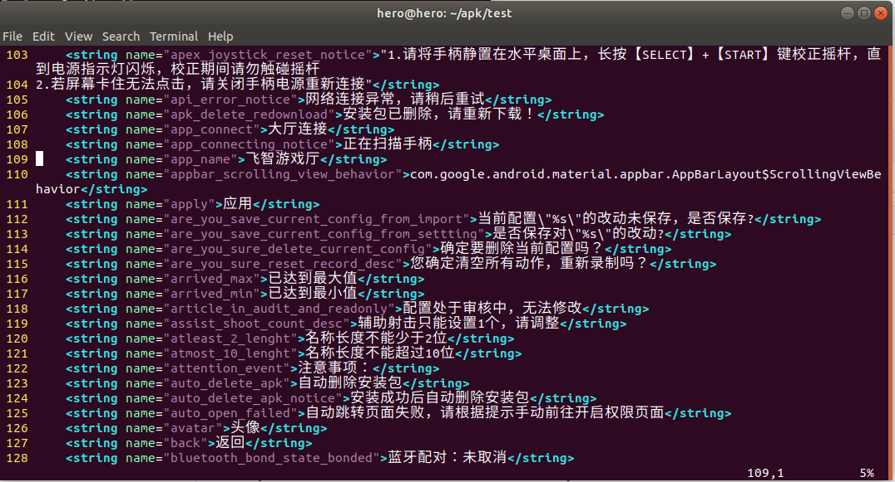
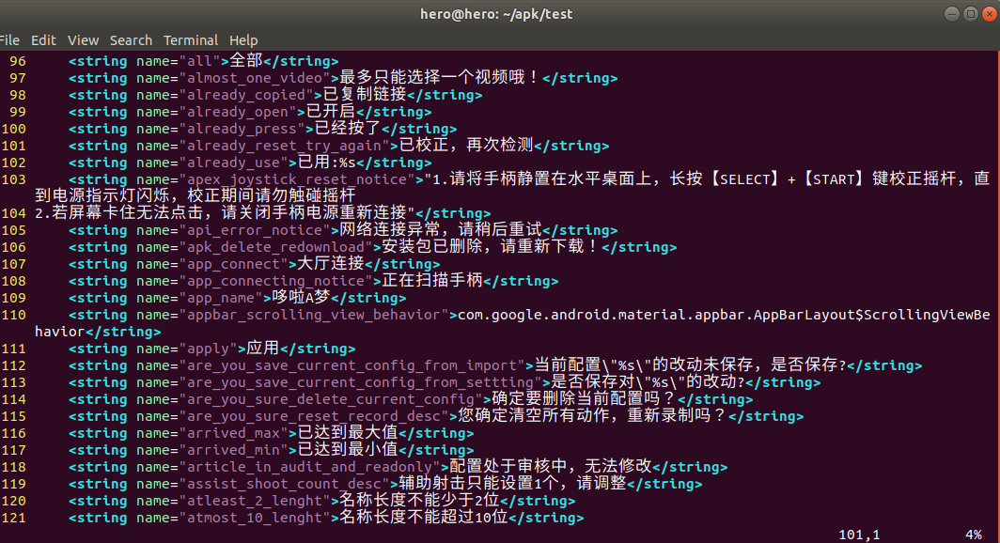

# Android逆向工程

## 所需工具

> 如果只是分析apk文件，可以使用Android-classyshark或者Android Studio 2.2版本的APK Analyzer功能（只需要将目标apk拖入到Android Studio 2.2中即可）。

### Android-classyshark

> 下载地址：https://github.com/google/android-classyshark/releases。 需要安装 java jdk或者openjdk。
> 命令行运行 **java -jar ClassyShark.jar** ，然后将apk文件拖入即可。

> 原始分析三件套：apktool、dex2jar、jd-gui。
> * apktool:查看二进制文件（https://ibotpeaches.github.io/Apktool/install）。
> * dex2jar:将dex文件转换成Jar包（https://github.com/pxb1988/dex2jar）。
> * jd-gui:将Jar包文件反编译成java源文件（https://github.com/java-decompiler/jd-gui/releases）。

## 步骤

### 解包

``` {.line-numbers highlight=[3]}
hero@hero:~/apk/test$ ls
feizhi.apk
hero@hero:~/apk/test$ apktool d feizhi.apk
I: Using Apktool 2.4.1 on feizhi.apk
I: Loading resource table...
I: Decoding AndroidManifest.xml with resources...
I: Loading resource table from file: /home/hero/.local/share/apktool/framework/1.apk
I: Regular manifest package...
I: Decoding file-resources...
I: Decoding values */* XMLs...
I: Baksmaling classes.dex...
I: Baksmaling classes2.dex...
I: Baksmaling classes3.dex...
I: Copying assets and libs...
I: Copying unknown files...
I: Copying original files...
I: Copying META-INF/services directory
hero@hero:~/apk/test$ ls
feizhi  feizhi.apk
hero@hero:~/apk/test$ 
```

### 修改内容

#### 修改app_name



``` {.line-numbers highlight=[1]}
hero@hero:~/apk/test$ vim feizhi/res/values/strings.xml 
hero@hero:~/apk/test$ 
```



#### 修改图片文件

> 用同样分辨率的图片分别替换下列目录下的图片文件。

``` {.line-numbers highlight=[1, 2, 5, 8]}
hero@hero:~/apk/test$ ls feizhi/res/mipmap*
feizhi/res/mipmap-xhdpi:
ic_launcher.png

feizhi/res/mipmap-xxhdpi:
ic_launcher.png

feizhi/res/mipmap-xxxhdpi:
ic_launcher.png
hero@hero:~/apk/test$ 
```


### 回包

``` {.line-numbers highlight=[1, 17]}
hero@hero:~/apk/test$ apktool b feizhi
I: Using Apktool 2.4.1
I: Checking whether sources has changed...
I: Smaling smali folder into classes.dex...
I: Checking whether sources has changed...
I: Smaling smali_classes3 folder into classes3.dex...
I: Checking whether sources has changed...
I: Smaling smali_classes2 folder into classes2.dex...
I: Checking whether resources has changed...
I: Building resources...
I: Copying libs... (/lib)
I: Copying libs... (/kotlin)
I: Copying libs... (/META-INF/services)
I: Building apk file...
I: Copying unknown files/dir...
I: Built apk...
hero@hero:~/apk/test$ ls feizhi/dist/
feizhi.apk
hero@hero:~/apk/test$ 
```

### 添加签名

> 因为重新回包后的apk签名文件已经失效了，是无法直接在安卓系统安装的，所以需要重新添加签名。

#### 生成密钥

> keytool -genkeypair -v -keystore <filename>.keystore -alias <key-name> -keyalg RSA -keysize 2048 -validity 10000

> keytool 首先要求提供密钥存储的密码。 然后要求提供一些有助于创建密钥的信息。

``` {.line-numbers highlight=[1, 24]}
hero@hero:~/apk/test$ keytool -genkey -v -keystore android.keystore -alias androidtest -keyalg RSA -validity 10000
Enter keystore password:  
Re-enter new password: 
What is your first and last name?
  [Unknown]:  test
What is the name of your organizational unit?
  [Unknown]:  test
What is the name of your organization?
  [Unknown]:  test
What is the name of your City or Locality?
  [Unknown]:  test
What is the name of your State or Province?
  [Unknown]:  test
What is the two-letter country code for this unit?
  [Unknown]:  test
Is CN=test, OU=test, O=test, L=test, ST=test, C=test correct?
  [no]:  yes

Generating 2,048 bit RSA key pair and self-signed certificate (SHA256withRSA) with a validity of 10,000 days
	for: CN=test, OU=test, O=test, L=test, ST=test, C=test
[Storing android.keystore]
hero@hero:~/apk/test$ ls
android.keystore  feizhi  feizhi.apk
hero@hero:~/apk/test$ keytool -list -keystore android.keystore 
Enter keystore password:  
Keystore type: PKCS12
Keystore provider: SUN

Your keystore contains 1 entry

androidtest, Apr 15, 2020, PrivateKeyEntry, 
Certificate fingerprint (SHA-256): E0:0A:E8:A1:58:E0:6E:F5:9C:D3:4B:09:9D:67:15:B7:6A:42:F9:86:E5:2E:D2:43:37:1C:78:04:73:AB:FE:D5
hero@hero:~/apk/test$ 
```

#### jarsigner添加签名

> 如果没有jarsigner命令，请安装完整版jdk。
> 如：**sudo apt-get install openjdk-11-jdk**

``` {.line-numbers highlight=[1, 13, 17, 18]}
hero@hero:~/apk/test$ jarsigner -verbose -keystore android.keystore -signedjar ./feizhi/dist/newfeizhi.apk ./feizhi/dist/feizhi.apk androidtest

....

>>> Signer
    X.509, CN=test, OU=test, O=test, L=test, ST=test, C=test
    [trusted certificate]

jar signed.

Warning: 
The signer's certificate is self-signed.
hero@hero:~/apk/test$ ls -al feizhi/dist/
total 51044
drwxr-xr-x  2 hero hero     4096 4月  15 15:29 .
drwxr-xr-x 14 hero hero     4096 4月  15 15:19 ..
-rw-r--r--  1 hero hero 26002663 4月  15 15:19 feizhi.apk
-rw-r--r--  1 hero hero 26254758 4月  15 15:30 newfeizhi.apk
hero@hero:~/apk/test$ 
```

## 总结

> 接下来在安卓系统安卓该apk，就会发现名字和图标已经换了。
> 我当前的需求做到这一步就已经满足了，如果是需要多开应用，就需要修改包名，后续我有这需求再添加该步骤。

> 可以发现文件大小是变大了的，如果想优化，可以使用 **Zipalign** 优化 APK（https://docs.microsoft.com/zh-cn/xamarin/android/deploy-test/signing/manually-signing-the-apk）。
