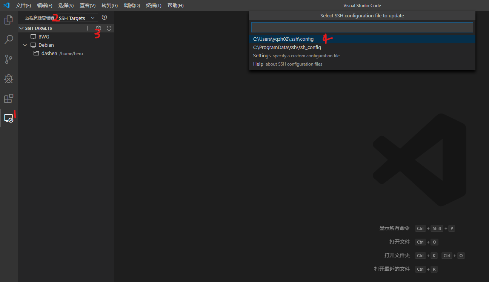
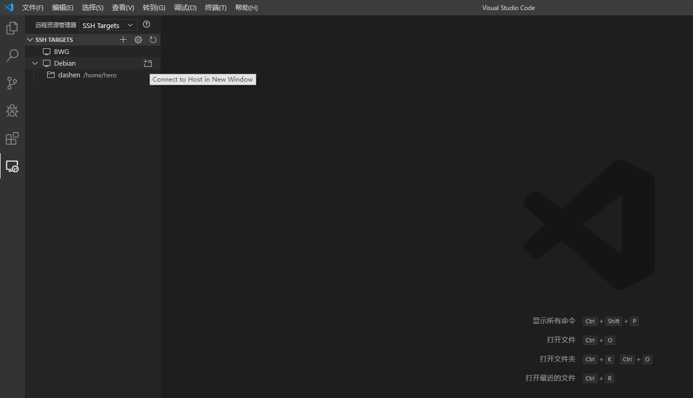
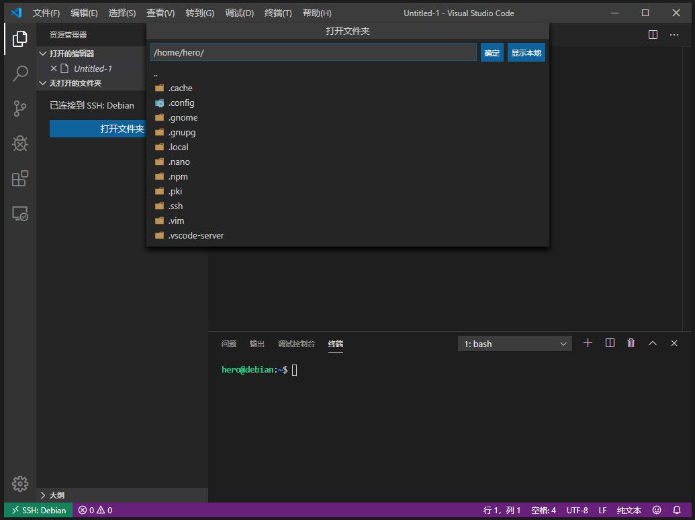

# VS Code 远程开发

> Visual Studio Code远程开发允许您使用容器，远程计算机或Linux的Windows子系统（WSL）作为功能齐全的开发环境。您可以：
>
> * 在您部署到的同一操作系统上进行开发，或使用更大或更专业的硬件。
> * 将开发环境沙盒化，以免影响本地计算机配置。
> * 使新贡献者易于上手，并使每个人都保持一致的环境。
> * 使用本地操作系统上不可用的工具或运行时，或管理它们的多个版本。
> * 使用Windows Linux子系统开发部署了Linux的应用程序。
> * 从多台机器或位置访问现有的开发环境。
> * 调试在其他位置（例如客户站点或云中）运行的应用程序。
>
> 要获得这些好处，您的本地计算机上不需要任何源代码。Remote Development扩展包中的每个扩展都可以直接在容器中，WSL中或在远程计算机上运行命令和其他扩展，因此一切都像在本地运行时一样。

## 安装Remote Development插件

> 该远程开发扩展包包括三个扩展。请参阅以下文章，以开始使用它们：
>
> * Remote - SSH -通过使用SSH打开远程计算机/ VM上的文件夹来连接到任何位置。
> * Remote - Containers -在容器内部（或安装到容器中）使用沙盒工具链或基于容器的应用程序。
> * Remote - WSL -在Windows子系统中获得Linux驱动的Linux开发经验。

## VS Code远程登录到服务器

### 密码登录

> 如下图那样打开SSH连接设置：




> 填好设置项后保存就会在目标主机里多配置好的服务器，选择服务器右边的连接即可。





### SSH密钥登录

> 如果不想每次登录都需要验证密码，可以生成SSH公共密钥到服务器。

#### 生成本地密钥

> 用Git bash在本地生成密钥


```{.line-numbers highlight=[2]}
yqzh02@CN8011DW00444 MINGW64 /c/Users/yqzh02/.ssh
$ ssh-keygen
Generating public/private rsa key pair.
Enter file in which to save the key (/d/Cadence/SPB_Data/.ssh/id_rsa): ./id_rsa
Enter passphrase (empty for no passphrase):
Enter same passphrase again:
Your identification has been saved in ./id_rsa.
Your public key has been saved in ./id_rsa.pub.
The key fingerprint is:
SHA256:Czp0tSnV7W29eZ/l2wDThx2t9GoiTf3sg68eCoyKzdA yqzh02@CN8011DW00444
The key's randomart image is:
+---[RSA 2048]----+
|                 |
|         . .    .|
|        o . . ...|
|       o o . = *.|
|    . + S   = B =|
|   ..o oo. o + =o|
|   .oE ..o. o.=o=|
|    =..   ...+.=*|
|   . +     ..oo+B|
+----[SHA256]-----+

```

> 连接到远程服务器并安装公共密钥

``` {.line-numbers highlight=[2, 21, 26, 37， 41]}
yqzh02@CN8011DW00444 MINGW64 /c/Users/yqzh02/.ssh
$ ssh hero@192.168.56.101 -p 22
hero@192.168.56.101's password:
Linux debian 4.9.0-8-amd64 #1 SMP Debian 4.9.144-3.1 (2019-02-19) x86_64

The programs included with the Debian GNU/Linux system are free software;
the exact distribution terms for each program are described in the
individual files in /usr/share/doc/*/copyright.

Debian GNU/Linux comes with ABSOLUTELY NO WARRANTY, to the extent
permitted by applicable law.
Last login: Thu Jan  2 00:47:36 2020 from 192.168.56.1
hero@debian:~$ ls /
bin   dev  home        initrd.img.old  lib64       media  opt   root  sbin  sys  usr  vmlinuz
boot  etc  initrd.img  lib             lost+found  mnt    proc  run   srv   tmp  var  vmlinuz.old
hero@debian:~$ exit
logout
Connection to 192.168.56.101 closed.

yqzh02@CN8011DW00444 MINGW64 /c/Users/yqzh02/.ssh
$ scp ./id_rsa.pub hero@192.168.56.101:/home/hero
hero@192.168.56.101's password:
id_rsa.pub                                                               100%  402   144.3KB/s   00:00

yqzh02@CN8011DW00444 MINGW64 /c/Users/yqzh02/.ssh
$ ssh hero@192.168.56.101 -p 22
hero@192.168.56.101's password:
Linux debian 4.9.0-8-amd64 #1 SMP Debian 4.9.144-3.1 (2019-02-19) x86_64

The programs included with the Debian GNU/Linux system are free software;
the exact distribution terms for each program are described in the
individual files in /usr/share/doc/*/copyright.

Debian GNU/Linux comes with ABSOLUTELY NO WARRANTY, to the extent
permitted by applicable law.
Last login: Thu Jan  2 01:28:12 2020 from 192.168.56.1
hero@debian:~$ ls
id_rsa.pub
hero@debian:~$

hero@debian:~$ cat ./id_rsa.pub >> .ssh/authorized_keys

```

> 这时就可以利用密钥登录到远程服务器

``` {.line-numbers highlight=[2]}
yqzh02@CN8011DW00444 MINGW64 /c/Users/yqzh02/.ssh
$ ssh hero@192.168.56.101 -i id_rsa
Linux debian 4.9.0-8-amd64 #1 SMP Debian 4.9.144-3.1 (2019-02-19) x86_64

The programs included with the Debian GNU/Linux system are free software;
the exact distribution terms for each program are described in the
individual files in /usr/share/doc/*/copyright.

Debian GNU/Linux comes with ABSOLUTELY NO WARRANTY, to the extent
permitted by applicable law.
Last login: Thu Jan  2 01:35:05 2020 from 192.168.56.1
hero@debian:~$
```

> 修改VS Code SSH设置以支持SSH密钥登录


## 远程开发

> 接下来就和本地开发一样了。
>
> **注意：有些插件需要在远程服务器上也开启。**
